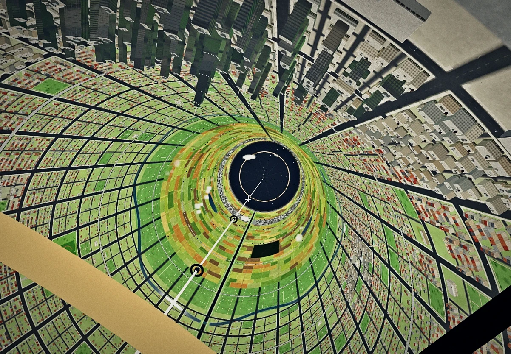
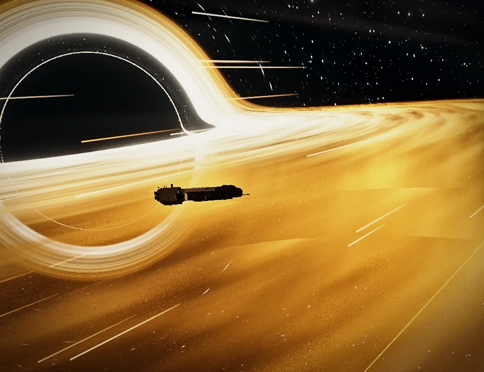
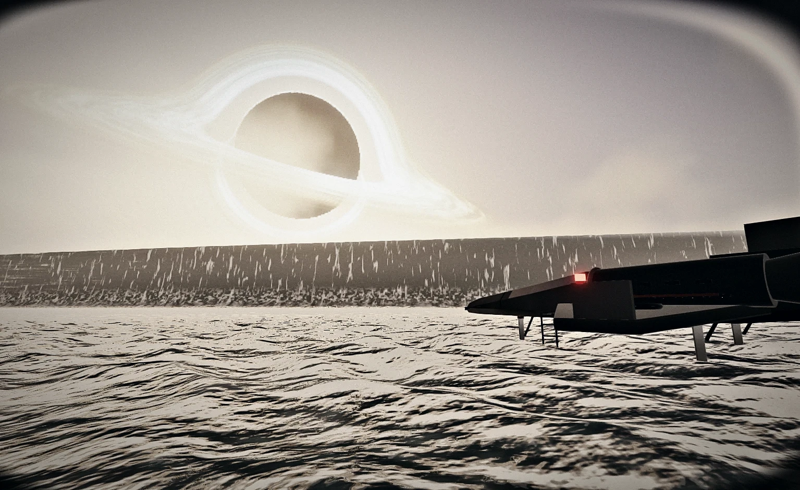

# Interstellia

A journey from Saturn to the edge of a black hole: a collection of interactive 3D experiences that run in the browser, from a single main menu.

Repository: https://github.com/bhaktiutama/interstellia

**Built with Claude Opus 5.5.** The code, GLSL shaders, physics, test scripts and design documents were written together with Claude Code (Claude Opus 5.5), with the project owner directing, playtesting and reviewing every stage.

## The experiences

### 01 Copper Corn Station (O'Neill cylinder)

**Walk the inside wall of a spinning city.** An 8 km O'Neill cylinder orbiting Saturn. City, fields and river wrap all around you, and a 63.4 s spin presses everything to the wall at 1 g. "Down" is always away from the axis.

| Key number | Value |
| --- | --- |
| Cylinder length / radius | 8 km / 1,000 m |
| One turn (gives 1 g at the wall) | 63.4 s |
| City districts | 14 |
| Saturn eclipse per orbit | 2.78 h |

| Feature | What you do |
| --- | --- |
| Tram and traffic | Trams with full interiors circle the city, cars queue at red lights, people cross at zebras |
| Lift to the zero-g axis | Ride the lift 1 km up to the axis hub as gravity slowly fades away until you float freely |
| KS-07 shuttle | Walk through the terminal to the dock, fly outside the station, then berth it yourself |
| 150 km/h motorbike | A V-twin café racer; you feel heavier riding with the spin and lighter riding against it |
| Weather and Coriolis | Dynamic clouds and rain; rain slants 8 degrees and the fountain curves from Coriolis |
| Saturn eclipse | Every orbit Saturn hides the Sun for 2.78 h: the sunline fades, the limb glows |

Keys: `WASD` walk, `E` action, `M` map, `C` bike, `8` cockpit, `F` photo.

### 02 Gargantua (supermassive black hole)

**Fall past the line not even light comes back from.** The GX-01 skims low over the accretion disk. Everything you see is computed by tracing bent light paths, not a painted backdrop.

| Key number | Value |
| --- | --- |
| Missions | 5 |
| Disk gas at the ISCO (relative to the craft) | 0.8 c |
| Critical capture / escape angle | 24.62 degrees |
| Relay station distance | 22 rs |

| Feature | What you do |
| --- | --- |
| Fall to the horizon | Fall straight in from the chase view or 3-screen cockpit on a limited delta-v budget |
| Skim the disk | Autopilot skims low to the ISCO, gas rushes by at 0.8 c, embers hit the glass |
| Signal relay | Fire flares to the 22 rs relay; a spacetime diagram shows why the craft clock freezes |
| Tesseract gate (fiction) | Freeze time, aim the entry angle at 24.62 degrees, then fly to the hypercube gate |
| Synthesized sound | Disk roar, creaking tidal strain, thrusters and relay beeps, all generated live in the browser |
| Photo mode | Hide the interface, tune screen effects, then save your gravitational lensing shot as a PNG |

Keys: `V` craft, `O` autopilot, `E` flare, `M` relay, `F` photo.

### 03 Millar's World (water world)

**One hour here, seven years pass outside.** What looks like mountains on the horizon is a wave. A shallow ocean with no land near Gargantua, at 1.3 g. Find wreck pieces by radar, then fly the KS-07 out before that wall of water arrives.

| Key number | Value |
| --- | --- |
| Surface gravity | 1.3 g |
| Wave height / speed | 1.2 km / 125 m/s |
| Time dilation | 1 hour = 7 years outside (61,362x) |

| Feature | What you do |
| --- | --- |
| Radar mission | Find 3 wreck pieces with radar pings and run the fastest route before the wave hits |
| Living ocean | FFT waves with foam and caustics, ripples at your feet, a backwash that drags at you |
| Fly the KS-07 | Climb into the 3-screen cockpit, lift off from the water and fly clear over the wave crest |
| Orbit and cinematics | Descend from orbit to the ocean surface, then leave again through reentry plasma |
| Astronaut body | See your own legs and gloves, a suit that gets wet, a visor with fog and water drops |
| Ocean sound | Wind, surf, your breath inside the helmet and the rumble of the giant wave drawing near |

Keys: `WASD` walk, `M` radar, `E` pick up / board, `V` camera, `U` sound.

### Coming soon: Kestrel Flight

Fly shuttle KS-07 from the dock to the rings of Saturn.

Common keys in every experience: `Q` graphics quality, `P` screen effects, `U` sound, `V` view, `F` photo mode, `` ` `` control panel, `?` help.

## Architecture: one experience = one HTML file

- Each experience is a single, self-contained HTML page (`experiences/<id>/index.html`) holding its CSS, JavaScript and GLSL shaders. The main menu is `index.html`.
- No build step, no bundler, no npm install. three.js 0.186.1 is loaded from a CDN through an import map; Gargantua is plain WebGL2.
- Data assets (models, textures) are plain `<script>` files with base64 data, so every page also runs straight from `file://`.
- Switching experiences is a full page load, so GPU memory is released cleanly between worlds.
- Shared code moves into `shared/` gradually (for example `shared/kestrel.js`, the KS-07 shuttle and cockpit used by Copper Corn Station and Millar's World).
- Language choice (Indonesian / English) is shared by every page through `localStorage` (`lazarus.lang`) and the `?lang=` parameter.

## Running

- Open `index.html` in a recent Chrome, Edge or Safari and pick an experience. An internet connection is needed for three.js.
- Or serve the repository with GitHub Pages (Settings > Pages > branch `main`, root folder).
- Tested on a PC with a GTX 1060 and on a MacBook M1. Press `Q` to change the graphics preset (the lowest preset is tuned for the M1).

## Repository layout

| Path | Contents |
| --- | --- |
| `index.html` | Main menu with an infographic per experience |
| `experiences/<id>/` | One folder per experience: `index.html`, menu photo `menu.webp`, preview, data assets |
| `shared/` | Code shared between experiences |
| `docs/` | Concepts, stage plans and design notes (Indonesian) |
| `tools/` | Load checks, test scripts and asset preparation scripts (Python / Node) |
| `CLAUDE.md` | Project context for Claude Code |

## Languages

Indonesian (source) and English. Japanese and Mandarin are postponed.

## Credits

- Café racer motorbike in Copper Corn Station: "moto guzzi v-twin" by Alexios Apokaukos, CC BY 4.0. Details in `experiences/cooper-station/assets/KREDIT.md`.
- Everything else (models, shaders, sound, the KS-07 and GX-01 designs) is original.

## Disclaimer

A fan project for learning physics and 3D graphics. Not affiliated with any film studio. It uses no film titles, logos, music, footage or vehicle designs.

## License

MIT, see `LICENSE`.
