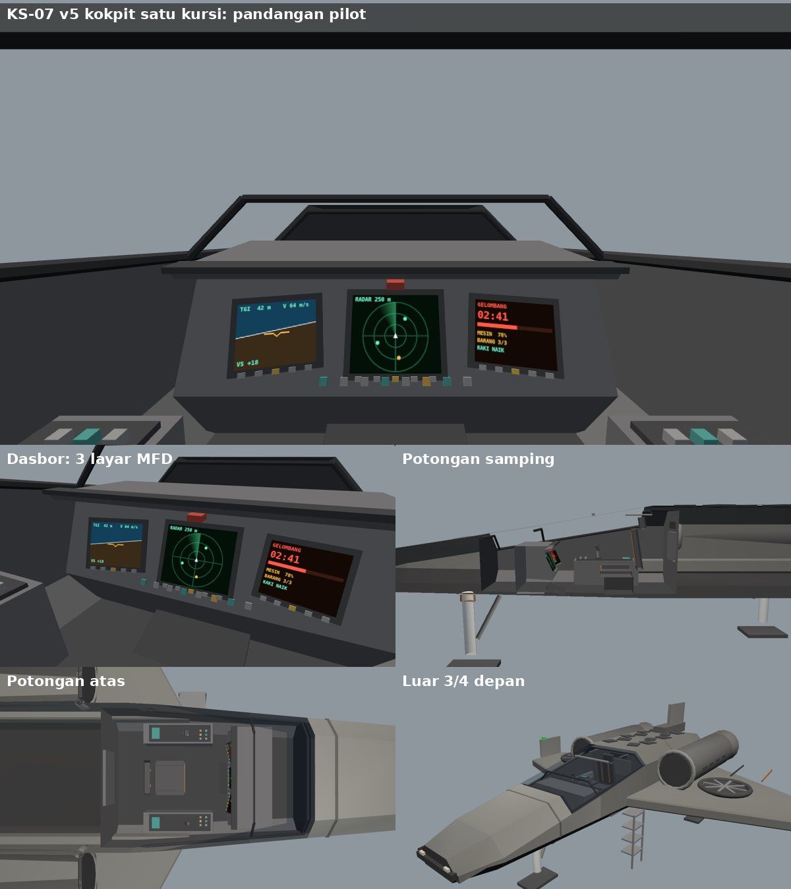

# Konsep Kokpit KS-07 v5

Per 30 September 2026 · Status: terpasang di Millar's World (pandangan kokpit, tombol V saat terbang) dan Copper Corn Station (kokpit shuttle, tombol 8).

## Ringkasan

- Kokpit satu kursi di dalam badan v5, geometri sungguhan di modul bersama `shared/kestrel.js` (`KESTREL.buildCockpitV5`), jadi Millar dan Copper memakai kokpit yang sama.
- Kaca kanopi dipisah dari badan dan diperpanjang 1 m ke depan (bentuk badan tetap), supaya pilot bisa melihat melewati hidung: 5,5 derajat ke bawah dari mata.
- Dasbor miring menghadap mata dengan 3 layar MFD. Isi layar digambar aplikasi (kanvas), jadi tiap experience bisa punya isi sendiri.
- Penampil konsep bisa diputar: `docs/app/kestrel/kokpit-ks07-v5.html` (1 = pandangan pilot, 2 = potongan samping, 3 = potongan atas, 4 = luar, 5 = dasbor).

## Bagian-bagian

| No | Bagian | Isi |
| --- | --- | --- |
| 1 | Pelapis dalam | Mengikuti penampang badan (skala 0,93 x 0,9), dibuka di bagian kaca. Lantai gelap, dinding abu gelap |
| 2 | Kanopi | Kaca 3 sisi atas dari z -3,6 sampai -0,6 m, rangka tepi kiri-kanan, lengkung depan, tengah, dan belakang, palang kaca tipis |
| 3 | Dasbor | Penutup silau di atas, muka miring 25 derajat menghadap mata, ceruk lutut di bawah, tombol darurat merah di tengah |
| 4 | Layar MFD | Kiri (terbang), tengah (utama, lebih besar), kanan (status). Masing-masing dengan 5 tombol tepi |
| 5 | Konsol samping | Kiri: tuas gas. Kanan: tongkat samping. Tombol dan pelat label berlampu redup |
| 6 | Kursi | Tegak dengan sandaran sedikit miring, sandaran kepala, sabuk jingga, pijakan kaki |
| 7 | Sekat belakang | Panel peralatan dan dua pegangan di atap |

## Isi layar

| Layar | Millar's World | Copper Corn Station |
| --- | --- | --- |
| Kiri | Sikap terbang (cakrawala buatan ikut angguk dan guling), ketinggian di atas air, kecepatan tegak, kecepatan, arah | Data sandar: jarak, kecepatan, laju mendekat, geser samping, batang kecepatan dengan batas 30 m/s |
| Tengah | Pindai 400 m (hidung ke atas): tinggi air di sekitar wahana, merah = air lebih tinggi dari wahana, titik kuning = barang misi | Penunjuk arah berth 1 (tengah = tepat di depan, merah di tepi = di belakang) |
| Kanan | Gelombang: waktu tiba atau LOLOS, mesin, barang, kaki | Mode (terbang, sandar, rem, E sandar, kurangi V), jarak ke stasiun, mesin dan RCS |

Tongkat dan tuas gas bergerak mengikuti kendali (W/S dan A/D untuk tongkat, dorongan mesin untuk tuas).

## Ukuran

| Ukuran | Nilai |
| --- | --- |
| Mata pilot (koordinat wahana) | x 0, y 0,68 m, z -1,15 m |
| Jarak mata ke atap luar | 0,27 m |
| Pandangan lewat hidung | 5,5 derajat ke bawah |
| Jarak mata ke layar tengah | sekitar 1,3 m |
| Ukuran layar | tengah 36 x 30 cm, samping 30 x 24 cm |

## Perbaikan model v5 yang ikut dikerjakan

| Masalah | Sebab | Perbaikan |
| --- | --- | --- |
| Garis tipis melayang di depan kanopi (terlihat di tangkapan layar M3d) | Cincin sambungan panel di z -4,0 memakai penampang badan belakang yang lebih lebar | Memakai penampang di z itu (`v5At`) |
| Gosong perut ada di punggung | Urutan segitiga loft terbalik (normal ke dalam); tersamar karena shader Millar dua sisi | Urutan diperbaiki, sayap kiri cermin juga; diuji: 2.436 dari 2.436 segitiga sesuai normal |
| Kaca tidak tembus pandang dari dalam | Kaca satu geometri dengan badan | `KS.glass` terpisah, dirender satu sisi |

## Hak cipta

Tata letak kokpit mengikuti ciri umum kokpit satu kursi (dasbor dengan layar, tongkat samping, tuas gas di kiri). Tidak meniru kokpit kendaraan film mana pun.
