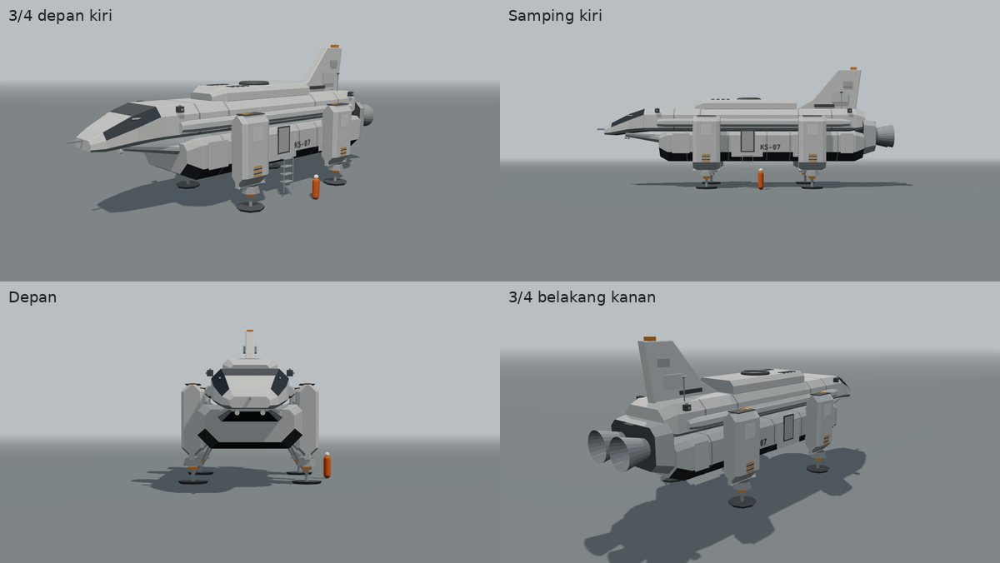
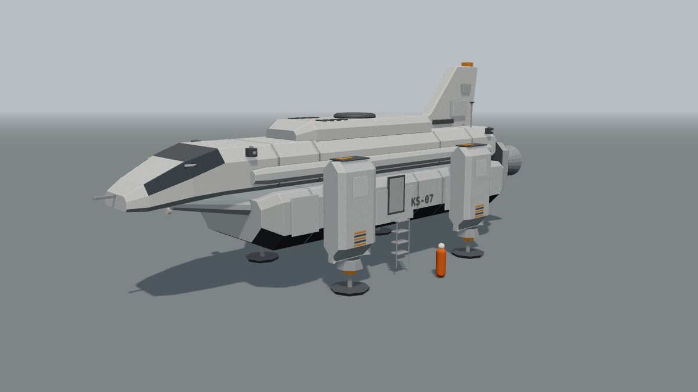
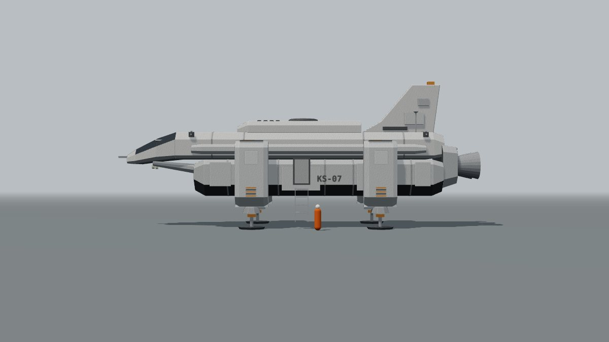
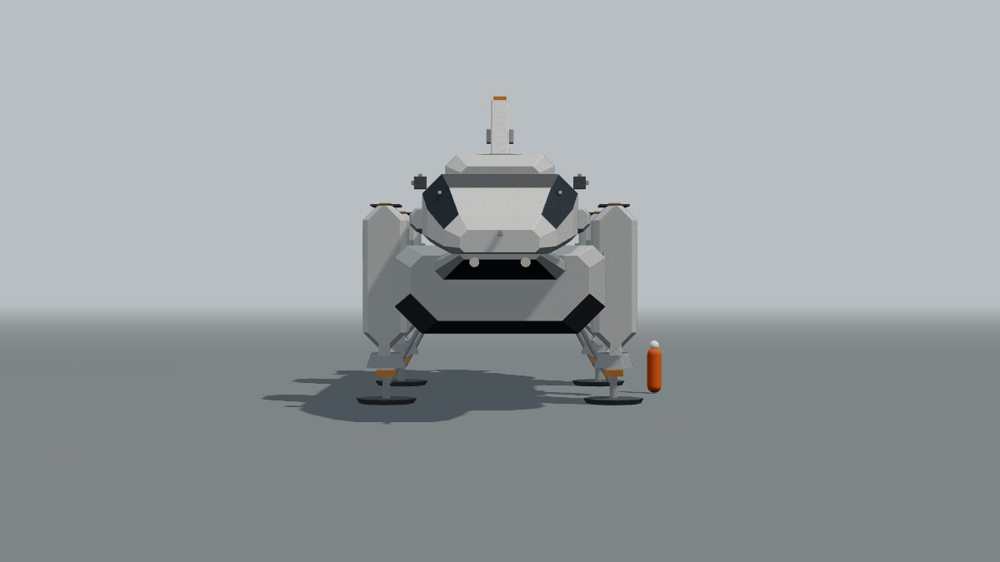
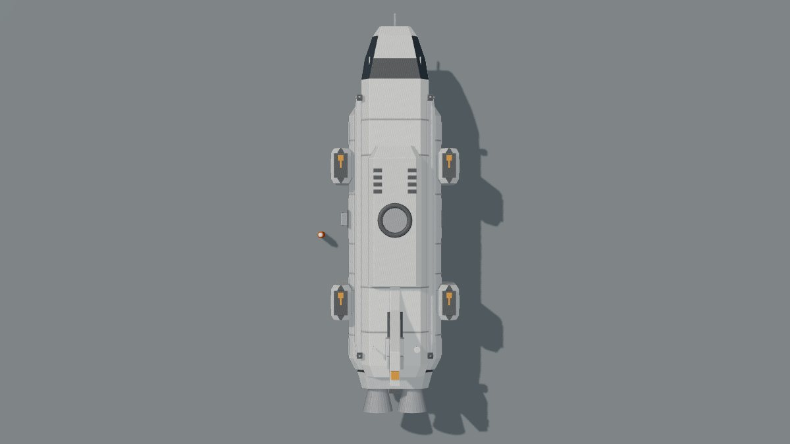
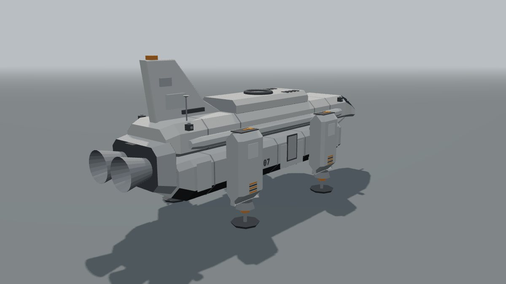

# Konsep Shuttle KS-07 "Kestrel" v2

Per 30 September 2026 · Status: v2b (simetris), menunggu persetujuan pemilik. Belum dipasang di game.

## Ringkasan

- v2b simetris kiri-kanan. Susunannya dua tingkat: kabin awak (badan atas) duduk di atas badan bawah yang lebar (tangki dan kargo), dengan hidung paruh, punggung bertingkat, sirip ekor di tengah, dan empat rumah pendorong tegak di sisi badan bawah.
- Kulit dan otot diambil dari sketsa referensi: pelat lambung menonjol, sambungan panel, blok pendorong tegak bertanda panah, rahang berlapis di bawah paruh, sirip dengan blok peralatan, registrasi besar di sisi. Gaya pelat bersudut tajam dan kesan berat diambil dari foto referensi.
- Blokout 3D bisa diputar di `docs/app/kestrel/blokout-ks07.html` (seret = putar, 1-5 = sudut pandang).

## Riwayat konsep

| Versi | Isi | Keputusan pemilik |
| --- | --- | --- |
| v1 (di game sekarang) | Badan pengangkat membulat, sayap, dua sirip miring | Terlalu mirip pesawat Bumi |
| v2a | Kotak, sangat tidak simetris: kokpit kiri, sponson kanan, pod miring di kiri | Terlalu tidak simetris ([lembar v2a](kestrel/ks07-v2a-lembar.jpg)) |
| v2b | Simetris, dua tingkat, empat rumah pendorong tegak, kulit dan otot dari sketsa | Menunggu |

## Referensi dan hak cipta

| Referensi | Yang diambil | Yang tidak diambil |
| --- | --- | --- |
| Foto kendaraan pendarat (kiriman terakhir) | Gaya umum: pelat datar bersudut tajam, badan rendah dan berat, perut bersudut potong besar, warna logam abu | Foto ini kendaraan pendarat dari film. Aturan proyek melarang meniru desain kendaraan film, jadi susunannya tidak dipakai: badan tengah dengan empat pod besar bersudut di keempat sudut |
| Sketsa pensil | Komposisi dan detail: badan atas di atas kotak bawah yang lebar, hidung paruh dengan kaca miring, blok pendorong tegak di sisi dengan tanda panah, sirip tinggi dengan blok peralatan, pelat lambung, registrasi besar di sisi kotak bawah | Garis, proporsi persis, dan tulisan sketsa tidak dijiplak; nomor yang dipakai hanya KS-07 |

Perbedaan utama dengan kendaraan film: KS-07 v2b punya sirip ekor, hidung paruh dengan kaca celah, kabin awak terpisah di atas, dan pendorong berupa rumah tegak ramping yang menempel di sisi badan bawah (bukan pod besar di sudut yang menggantung).

## Bagian-bagian

| No | Bagian | Posisi dan ukuran | Fungsi |
| --- | --- | --- | --- |
| 1 | Badan bawah | 17,8 m x 6,2 m x 2,6 m, perut bersudut potong besar | Tangki bahan bakar dan ruang kargo; perut hitam = perisai panas |
| 2 | Badan atas | 19,4 m x 4,4 m x 1,9 m, di atas badan bawah | Kabin awak dan ruang penumpang |
| 3 | Hidung paruh | Turun miring ke depan, 3,7 m | Kokpit dua kursi; kaca celah miring di kedua bahu, panel anti-silau di tengah, probe di ujung |
| 4 | Rahang bawah | Di bawah paruh | Pelat berlapis, dua lampu sorot pendaratan |
| 5 | Otot bahu | Pelat bersudut memanjang di kiri dan kanan badan atas | Saluran kabel dan pipa, pelindung benturan |
| 6 | Punggung bertingkat | Dek tengah 8,2 m x 3,4 m, cincin sandar di atasnya | Modul sandar untuk dermaga Copper, kisi ventilasi |
| 7 | Sirip ekor | Tengah belakang, 5,9 m menyapu, tebal 0,56 m | Radiator dan antena; blok peralatan di kedua sisi, strobo di puncak |
| 8 | Rumah pendorong | Empat, tegak di sisi badan bawah (2 kiri, 2 kanan), 1,35 m x 2,3 m x 4,6 m | Mesin angkat untuk melayang dan mendarat: kisi udara di atas bertanda panah, nosel bersudut di bawah, garis bahaya jingga |
| 9 | Mesin belakang | Blok mesin + dua nosel sejajar | Dorongan maju di luar angkasa |
| 10 | Pintu awak | Kiri dan kanan badan bawah, di antara rumah pendorong; tangga lipat di kiri | Naik dan turun (E di Millar) |
| 11 | Kaki pendarat | Empat, satu di bawah tiap rumah pendorong, tapak segi delapan 1,9 m | Mendarat di air atau tanah, penopang diagonal ke rumah pendorong |
| 12 | Kulit | Sambungan panel melingkar, pelat lambung menonjol, stensil KS-07 besar di sisi badan bawah dan kecil di dekat kokpit, RCS di empat sudut | Kesan kendaraan kerja yang nyata |

## Ukuran (dari blokout)

| Ukuran | Nilai |
| --- | --- |
| Panjang (hidung sampai ujung nosel) | sekitar 25,7 m (26,5 m dengan probe hidung) |
| Lebar (luar rumah pendorong) | sekitar 8,5 m |
| Tinggi saat mendarat (tapak sampai puncak sirip) | sekitar 10,5 m |
| Jarak perut ke tapak | 2,3 m |

## Warna

| Bagian | Warna |
| --- | --- |
| Badan atas | Abu sangat terang, nada tiap panel sedikit berbeda |
| Badan bawah dan rumah pendorong | Abu sedang (lebih gelap dari badan atas, seperti arsiran sketsa) |
| Perut | Hitam (perisai panas) |
| Tanda | Jingga hanya di tanda panah, garis bahaya dekat nosel, kerah kaki, strobo sirip |

## Gerak (untuk M3b dan Copper)

| Gerak | Isi |
| --- | --- |
| Rumah pendorong | Nosel bawah bisa miring maju-mundur untuk bergerak saat melayang |
| Kaki | Ditarik ke dalam rumah pendorong saat terbang |
| Pintu dan tangga | Pintu bergeser, tangga turun saat pemain dekat (E) |
| Lampu | Lampu sorot rahang, strobo sirip, lampu navigasi merah-hijau di rumah pendorong depan |
| Semburan | Empat nosel meniup air dan kabut saat lepas landas di Millar |

## Dampak ke experience

| Experience | Perubahan |
| --- | --- |
| Copper Corn Station | Shuttle pemain dan terjadwal di dermaga ganti model. Panjang naik sekitar 1,7 m, jadi posisi sandar di berth perlu dicek. Cincin sandar tetap di punggung. Kokpit tetap di tengah, jadi posisi mata cukup digeser ke paruh baru. Uji spaceport dijalankan ulang |
| Millar's World | Shuttle mendarat dengan 4 kaki, perut 2,3 m di atas tapak. Tabrakan kaki dan posisi pintu kiri untuk E disesuaikan |
| Modul bersama | `shared/kestrel.js`: `build()` diganti v2b, v1 disimpan sebagai `buildV1()` selama masa transisi |

## Pilihan untuk pemilik

| No | Pertanyaan | Pilihan | Disarankan |
| --- | --- | --- | --- |
| 1 | Sirip ekor | a. Satu sirip tengah (seperti sketsa) · b. Tanpa sirip (lebih rata dan berat) | a |
| 2 | Hidung | a. Paruh tumpul (blokout sekarang) · b. Lebih panjang dan runcing seperti sketsa | a |
| 3 | Warna | a. Atas terang, bawah abu sedang · b. Seluruhnya abu logam (seperti foto) | a |
| 4 | Pintu | a. Kiri dan kanan · b. Kiri saja | a |

## Gambar

| Sudut | Gambar |
| --- | --- |
| 3/4 depan kiri |  |
| Samping kiri |  |
| Depan |  |
| Atas |  |
| 3/4 belakang kanan |  |

Catatan: ini blokout (bentuk dan tata letak), bukan tampilan akhir. Versi di game memakai shading masing-masing experience dan tambahan detail kecil: pegangan, baut, kotoran, bekas panas di sekitar nosel.

## Langkah setelah disetujui

1. Model v2b di `shared/kestrel.js` (loft segi delapan, tanpa addon three.js), sidik jari geometri dicatat di uji.
2. Millar: ganti shuttle, 4 kaki, pintu kiri untuk E, lalu lanjut M3b (naik dan terbang).
3. Copper: ganti model di dermaga, cek posisi sandar dan mata kokpit, uji spaceport.
