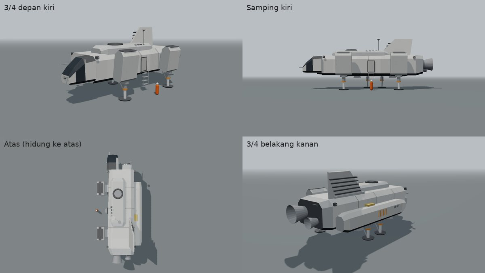
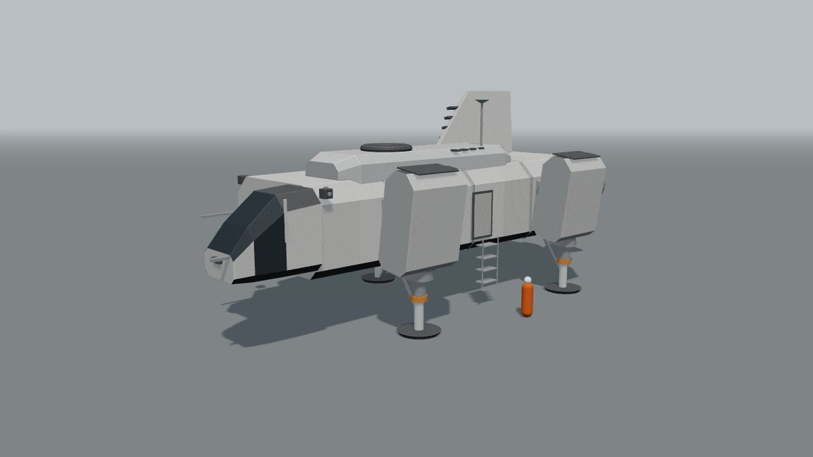
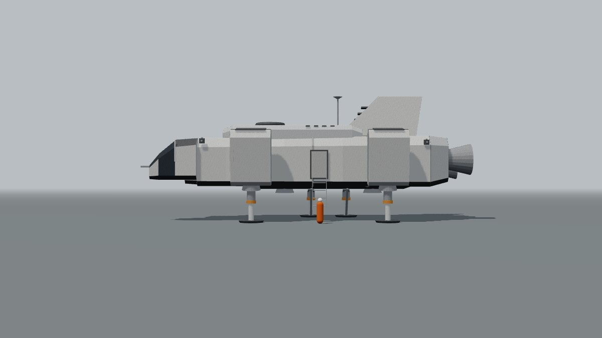
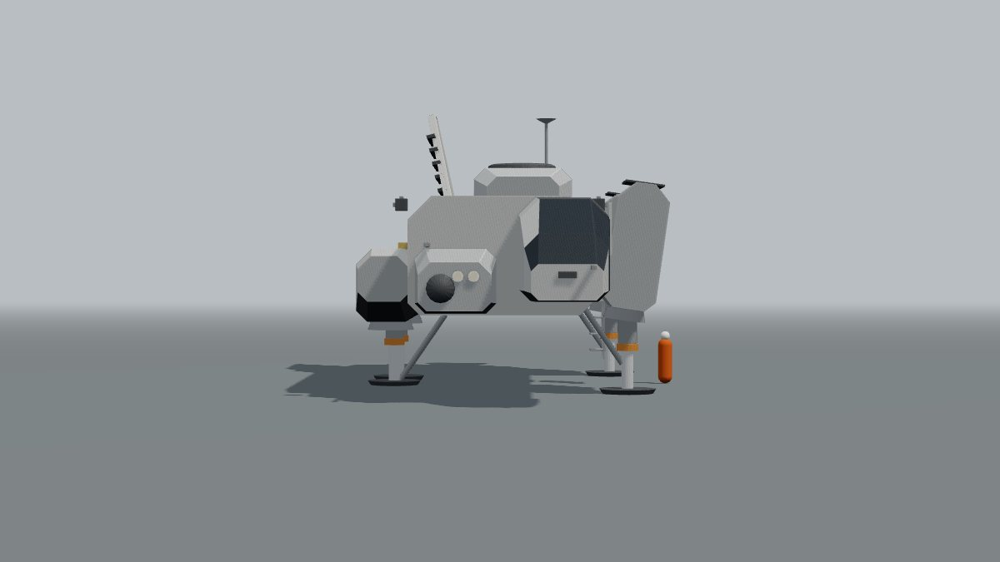
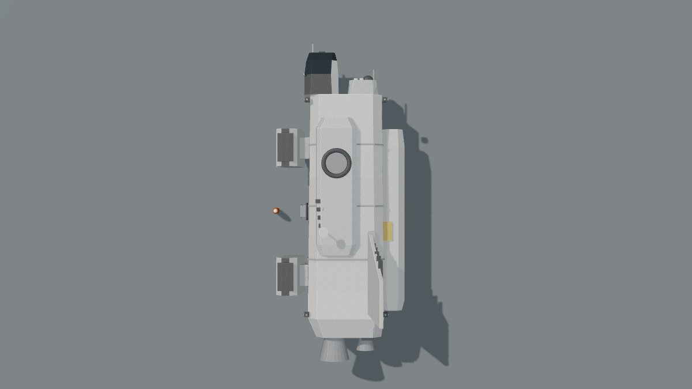
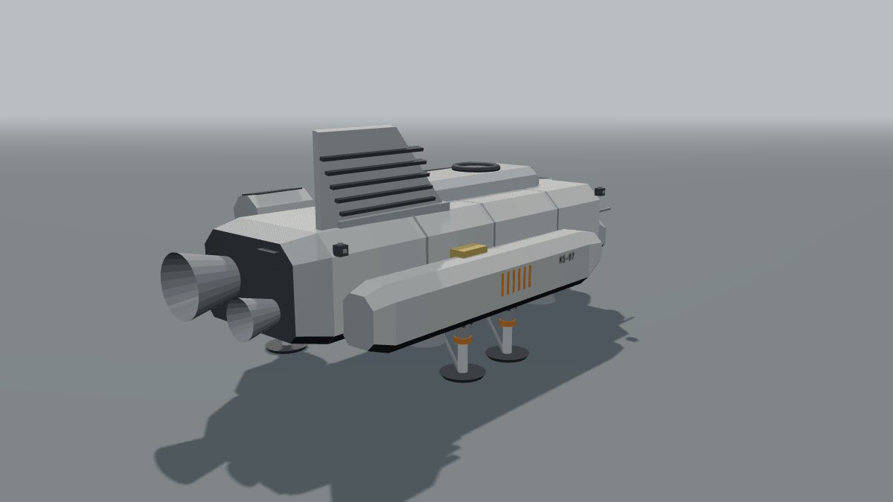

# Konsep Shuttle KS-07 "Kestrel" v2

Per 30 September 2026 · Status: konsep, menunggu persetujuan pemilik. Belum dipasang di game.

## Ringkasan

- KS-07 sekarang (badan pengangkat bulat, sayap, sirip ganda) terlihat seperti pesawat Bumi. Versi 2 diganti menjadi kendaraan kerja luar angkasa: kotak bersudut potong, tidak simetris, semua bagian punya fungsi yang terlihat.
- Ketidakseimbangan disengaja: kokpit menonjol di kiri depan, sponson bahan bakar di kanan, dua pod angkat miring di kiri, sirip radiator di kanan belakang, dua mesin utama beda ukuran. Berat tetap seimbang karena tangki di kanan mengimbangi kokpit dan pod di kiri.
- Panjang tetap sekitar 24 m supaya dermaga Copper Corn Station tidak perlu diubah. Blokout 3D bisa diputar di `docs/app/kestrel/blokout-ks07.html` (seret = putar, 1-5 = sudut pandang).

## Masalah versi sekarang

| Bagian | Versi 1 | Kesan |
| --- | --- | --- |
| Badan | Badan pengangkat halus membulat (superellipse) | Pesawat terbang / pesawat ulang-alik Bumi |
| Sayap dan sirip | Sayap pendek + dua sirip miring | Pesawat tempur |
| Simetri | Simetris kiri-kanan penuh | Rapi seperti mainan, tidak terasa "dipakai" |
| Kaki di Millar | Tiga kaki ramping | Tidak cocok dengan badan pesawat terbang |

## Prinsip desain v2

| Prinsip | Wujud |
| --- | --- |
| Kotak, bukan aerodinamis | Badan segi delapan (sudut dipotong), sambungan panel menonjol, punggung bertingkat. Shuttle ini turun ke planet memakai mesin angkat dan perisai panas di perut, bukan sayap |
| Tidak simetris tapi seimbang | Bagian berat dibagi tidak sama di kiri dan kanan, dan pusat massa dijaga di tengah oleh tangki kanan dan dorongan pod yang bisa diatur |
| Fungsi terlihat | Nosel angkat di bawah, kisi masuk udara di atas pod, pipa radiator di sirip, cincin sandar di punggung, tangga dan pintu yang jelas |
| Realistis dan dipakai | Warna abu terang dengan nada panel berbeda, perut hitam (perisai panas), tanda bahaya jingga hanya di dekat nosel dan kaki, registrasi KS-07 dicat stensil |

## Bagian-bagian

| No | Bagian | Posisi | Fungsi dan alasan |
| --- | --- | --- | --- |
| 1 | Badan utama | Tengah, 17 m x 5,4-5,8 m x 3,5-3,7 m, sedikit melebar ke belakang | Kabin awak dan kargo, perut rata hitam sebagai perisai panas saat masuk atmosfer |
| 2 | Kokpit | Kiri depan, menonjol 3,4 m ke depan dari badan | Kabin tumpul seperti kabin derek: kaca depan miring tiga panel, jendela samping kiri dan atap. Pilot duduk di kiri supaya bisa melihat ke bawah saat mendarat vertikal |
| 3 | Blok sensor | Kanan depan, lebih pendek dan lebih rendah dari kokpit | Kubah lidar, dua lampu sorot, tiang sensor. Mengisi sisi kanan hidung, membuat siluet depan bertingkat |
| 4 | Sponson kanan | Sisi kanan bawah, 14 m | Tangki bahan bakar + dua nosel angkat + dua kaki kanan. Garis bahaya jingga di dekat nosel, teluk peralatan berlapis foil emas |
| 5 | Dua pod angkat kiri | Kiri depan dan kiri belakang, di lengan pendek, miring 8 derajat ke luar, lebih tinggi dari atap | Mesin angkat berkipas (kisi udara di atas, nosel di bawah). Bisa diputar untuk mengatur keseimbangan dan arah saat melayang |
| 6 | Mesin utama | Belakang: satu besar di kiri-tengah, satu kecil di kanan, knalpot APU di kanan atas | Dorongan maju di luar angkasa; dua ukuran berbeda untuk gerak halus dan cadangan |
| 7 | Punggung bertingkat | Atas, sedikit ke kiri | Modul awak kedua, cincin sandar untuk dermaga Copper, kisi ventilasi |
| 8 | Sirip radiator | Kanan belakang, miring ke luar | Membuang panas (lima pipa radiator). Bukan sirip terbang, jadi boleh miring dan tidak simetris |
| 9 | Pintu dan tangga | Sisi kiri tengah, di antara dua pod | Pintu awak dengan tangga lipat 4 anak tangga ke air/tanah. Dipakai untuk E naik di Millar (M3b) |
| 10 | Kaki pendarat | 4 kaki: dua di sponson kanan, dua di bawah pod kiri | Batang teleskop dengan kerah jingga dan penopang diagonal, tapak lebar 1,8 m. Perut 2,55 m di atas tapak (pemain di air setinggi lutut bisa berjalan di bawahnya) |
| 11 | RCS dan antena | Empat sudut badan, antena di punggung | Pendorong kecil empat arah untuk sandar; antena komunikasi |

## Ukuran (dari blokout)

| Ukuran | Nilai |
| --- | --- |
| Panjang (ujung kokpit sampai ujung nosel mesin) | sekitar 23,6 m |
| Lebar (pod kiri sampai sponson kanan) | sekitar 9,8 m |
| Tinggi badan | 3,5-3,7 m; dengan punggung 4,6 m |
| Tinggi total saat mendarat (tapak sampai ujung sirip) | sekitar 9,5 m |
| Jarak perut ke tapak | 2,55 m |

## Hubungan dengan referensi dan hak cipta

| Referensi | Yang diambil | Yang tidak diambil |
| --- | --- | --- |
| Sketsa pensil (kiriman pemilik) | Watak umum: badan kotak panjang, hidung miring bersudut, pod dorong tegak di samping, sirip tinggi | Bentuk, tata letak, dan tulisan sketsa tidak dijiplak |
| Foto kendaraan pendarat | Kesan kendaraan kerja kotak dengan pod besar, pintu samping | Gambar kedua mirip kendaraan dari film. Sesuai aturan proyek (jangan meniru desain kendaraan film), susunan empat pod kotak yang sama besar dan simetris tidak dipakai. KS-07 v2 memakai susunan sendiri: 2 pod miring di kiri + sponson di kanan, kokpit samping |

## Gerak (untuk M3b dan Copper)

| Gerak | Isi |
| --- | --- |
| Pod angkat | Miring 0-90 derajat: tegak saat melayang, mendatar saat terbang maju |
| Kaki | Ditarik masuk saat terbang, keluar sebelum mendarat |
| Pintu dan tangga | Pintu bergeser, tangga turun saat pemain dekat (E) |
| Lampu | Lampu navigasi di ujung sponson dan pod, strobo di sirip, lampu sorot blok sensor |
| Semburan | Nosel angkat meniup air dan kabut ke samping saat lepas landas di Millar |

## Dampak ke experience

| Experience | Perubahan |
| --- | --- |
| Copper Corn Station | Shuttle pemain dan shuttle terjadwal di dermaga ganti model. Cincin sandar kini di punggung (dulu di atas badan, posisi serupa). Posisi mata kokpit berubah dari tengah ke kiri depan, jadi interior kokpit Copper perlu disesuaikan. Uji spaceport dijalankan ulang |
| Millar's World | Shuttle mendarat memakai kaki v2 (4 kaki). Tabrakan kaki, posisi pintu untuk E, dan jarak perut disesuaikan |
| Modul bersama | `shared/kestrel.js`: `build()` diganti v2, versi 1 disimpan sebagai `buildV1()` selama masa transisi |

## Pilihan untuk pemilik

| No | Pertanyaan | Pilihan | Disarankan |
| --- | --- | --- | --- |
| 1 | Letak kokpit | a. Kiri depan menonjol (seperti blokout) · b. Tengah depan, tetap kotak | a |
| 2 | Pod angkat kiri | a. Miring ke luar 8 derajat · b. Tegak | a |
| 3 | Warna | a. Abu terang dengan nada panel berbeda + perut hitam · b. Abu gelap (lebih militer) · c. Putih dengan blok jingga besar | a |
| 4 | Jumlah kaki | a. 4 kaki (dua sponson, dua pod) · b. 3 kaki | a |
| 5 | Sirip | a. Satu sirip radiator di kanan belakang · b. Tanpa sirip, radiator rata di punggung | a |

## Gambar

| Sudut | Berkas |
| --- | --- |
| 3/4 depan kiri |  |
| Samping kiri |  |
| Depan |  |
| Atas |  |
| 3/4 belakang kanan |  |

Catatan: gambar ini blokout (bentuk dan tata letak), bukan tampilan akhir. Versi di game akan memakai shading masing-masing experience (langit mendung di Millar, cahaya Matahari dan dermaga di Copper), ditambah detail kecil: garis panel, pegangan, stensil, kotoran dan bekas panas.

## Langkah setelah disetujui

1. Model v2 di `shared/kestrel.js` (loft segi delapan, tanpa addon three.js), sidik jari geometri dicatat di uji.
2. Millar: ganti shuttle, kaki 4, pintu kiri untuk E, lalu lanjut M3b (naik dan terbang).
3. Copper: ganti model di dermaga, sesuaikan kokpit dan cincin sandar, uji spaceport.
