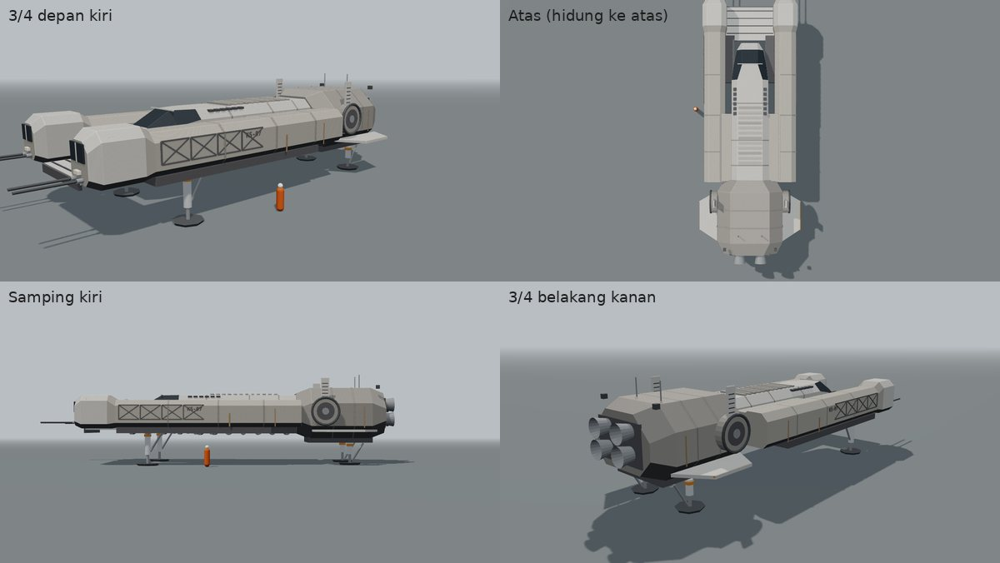
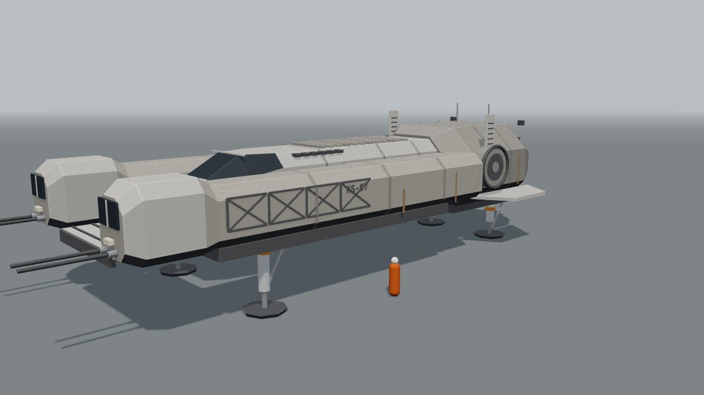
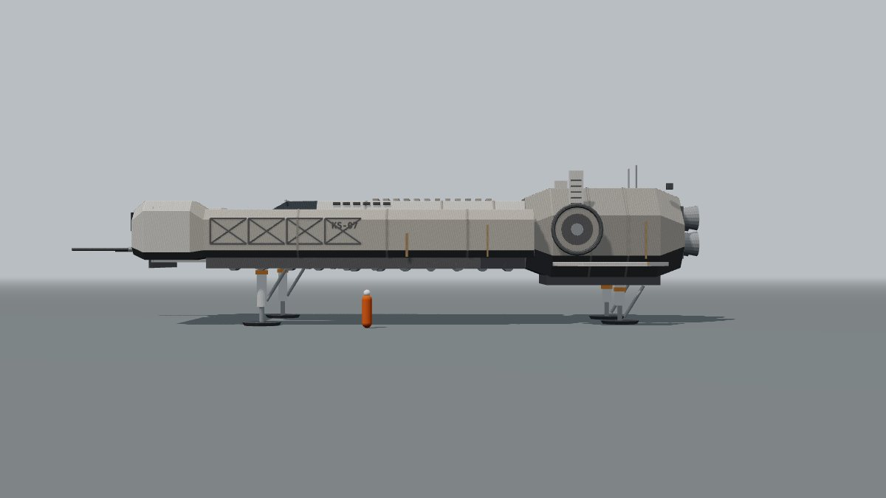
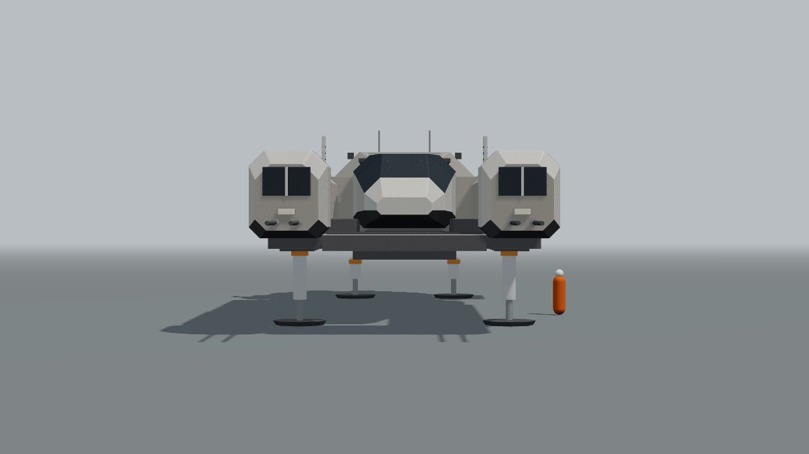
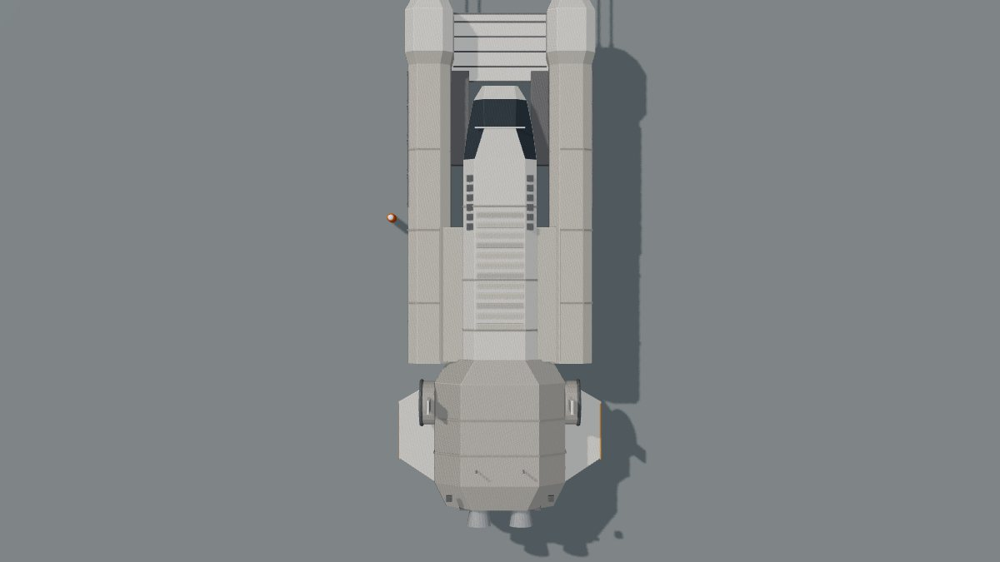
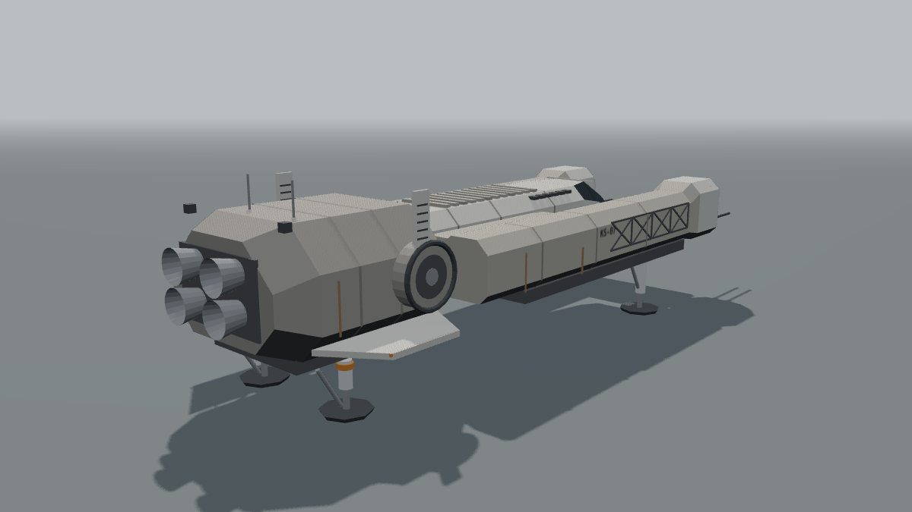

# Konsep Shuttle KS-07 v3 (hibrida)

Per 30 September 2026 · Status: konsep, menunggu persetujuan pemilik. Model v2b tetap disimpan (`konsep-ks07-v2.md`, `kestrel/blokout-ks07-v2b.html`). Belum dipasang di game.

## Ringkasan

- v3 menggabungkan dua referensi terbaru. Dari sketsa spidol: badan panjang kotak, dua lengan depan berkabin jendela dengan batang probe kembar, rangka silang di sisi, dek bersirip di atas, blok belakang bersegi berat, pendorong cakram di sisi. Dari foto kapal di laut: garpu depan yang terbuka dengan pelat dek putih di antaranya, kokpit kaca bersekat di tengah, pelat sayap rendah bersudut, rangka mesin terbuka di bawah.
- Simetris kiri-kanan. Warna abu-krem lapuk dengan garis karat tegak (seperti arsiran spidol), pelat putih dan aksen jingga sedikit, rangka bawah gelap.
- Blokout bisa diputar di `docs/app/kestrel/blokout-ks07-v3.html` (seret = putar, 1-5 = sudut pandang).

## Referensi

| Referensi | Yang diambil | Yang tidak diambil |
| --- | --- | --- |
| Sketsa spidol dua kapal | Watak dan komposisi: dua lengan depan berkabin, batang probe, rangka silang di sisi, dek bersirip, blok belakang bersegi, pendorong cakram dengan sirip kecil, garis karat | Garis, proporsi persis, dan tulisan sketsa tidak dijiplak |
| Foto kapal di laut | Gaya: garpu depan terbuka, pelat dek putih di antara garpu, kokpit kaca bersekat, pelat sayap rendah, rangka mesin terbuka di bawah | Foto ini tangkapan layar kapal dari sebuah game. Bentuk persisnya, susunan panel, dan warna emas tidak ditiru |

## Bagian-bagian

| No | Bagian | Posisi dan ukuran | Fungsi |
| --- | --- | --- | --- |
| 1 | Blok belakang | Prisma bersudut potong besar, 7,7 m x 6,8 m x 4,4 m | Mesin, reaktor, dan tangki; muka belakang berisi 2 x 2 nosel dalam ceruk gelap |
| 2 | Badan tengah | 11 m x 3,8 m x 2,7 m | Kabin awak; dek bersirip dan deret ventilasi di atas |
| 3 | Kokpit | Tengah depan, di antara dua lengan | Kaca bersekat (atas dan bahu), menjorok ke depan 4 m |
| 4 | Dua lengan depan (garpu) | Kiri dan kanan, 19 m x 2,2 m x 2,3 m | Ruang kargo dan peralatan; kabin berjendela di ujung, batang probe kembar, rangka silang di sisi luar, baki mesin terbuka di bawah |
| 5 | Pelat dek | Di antara ujung garpu, lantai putih 5,2 m x 3,6 m | Tempat muat barang atau wahana kecil (dipakai untuk kotak data suar di M3c) |
| 6 | Pendorong cakram | Kiri dan kanan blok belakang | Pendorong berarah (bisa berputar) untuk melayang dan belok, dengan sirip kecil bergaris |
| 7 | Pelat sayap rendah | Kiri dan kanan blok belakang | Penstabil saat terbang di atmosfer, garis jingga di tepi |
| 8 | Rangka bawah | Perut badan tengah dan blok belakang | Pipa dan rangka terbuka, kesan kendaraan kerja |
| 9 | Kaki pendarat | 4: dua di bawah lengan, dua di bawah blok belakang | Tapak segi delapan, kerah jingga, penopang miring |
| 10 | Kulit | Sambungan panel, garis karat, stensil KS-07 di sisi lengan, antena, RCS | Kesan dipakai dan lapuk |

## Ukuran (dari blokout)

| Ukuran | Nilai |
| --- | --- |
| Panjang (kabin garpu sampai ujung nosel) | sekitar 27,5 m (30,5 m dengan batang probe) |
| Lebar (luar lengan) | sekitar 9,9 m; dengan pelat sayap 10,9 m |
| Tinggi saat mendarat | sekitar 7,5 m |
| Jarak lengan ke tapak | 2,75 m (bisa berjalan di bawah lengan) |
| Jarak blok belakang ke tapak | 1,9 m |

## Perbandingan versi

| Versi | Watak | Status |
| --- | --- | --- |
| v1 | Badan pengangkat membulat, sayap | Di game sekarang; terlalu mirip pesawat Bumi |
| v2a | Kotak, sangat tidak simetris | Ditolak (terlalu tidak simetris) |
| v2b | Simetris, dua tingkat, empat rumah pendorong tegak | Disimpan |
| v3 | Simetris, garpu depan, blok belakang berat, lapuk | Disimpan |
| v4 | Badan tengah + dua nacelle menerus (`konsep-ks07-v4.md`) | Menunggu |

## Dampak ke experience

| Experience | Perubahan |
| --- | --- |
| Copper Corn Station | Lebih panjang sekitar 3,5 m dari v1; posisi sandar di berth perlu dicek. v3 belum punya cincin sandar: diusulkan di punggung badan tengah (di antara dek bersirip dan kokpit). Posisi mata kokpit pindah ke kokpit tengah v3 |
| Millar's World | 4 kaki, pemain bisa berjalan di bawah lengan. Pintu awak diusulkan di sisi dalam lengan kiri, menghadap pelat dek |

## Pilihan untuk pemilik

| No | Pertanyaan | Pilihan | Disarankan |
| --- | --- | --- | --- |
| 1 | Model untuk KS-07 | a. v3 hibrida · b. v2b · c. v3 untuk Millar, v2b untuk Copper | a |
| 2 | Batang probe di ujung garpu | a. Ada (seperti sketsa) · b. Lebih pendek · c. Tanpa | a |
| 3 | Warna | a. Abu-krem lapuk dengan garis karat · b. Lebih bersih (pelat putih lebih banyak) | a |
| 4 | Cincin sandar untuk Copper | a. Di punggung badan tengah · b. Di muka belakang | a |

## Gambar

| Sudut | Gambar |
| --- | --- |
| 3/4 depan kiri |  |
| Samping kiri |  |
| Depan |  |
| Atas |  |
| 3/4 belakang kanan |  |

Catatan: ini blokout (bentuk dan tata letak), bukan tampilan akhir.
