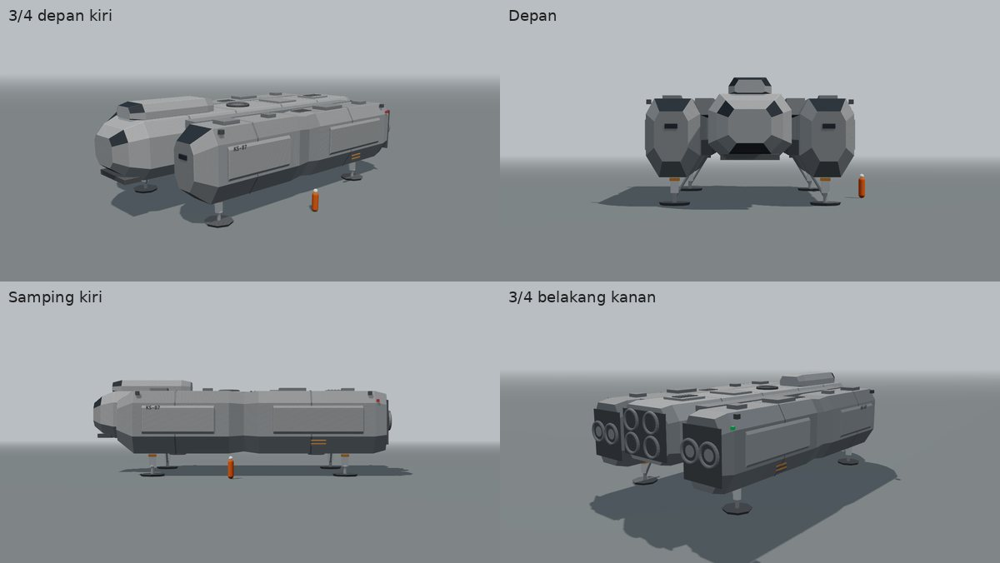
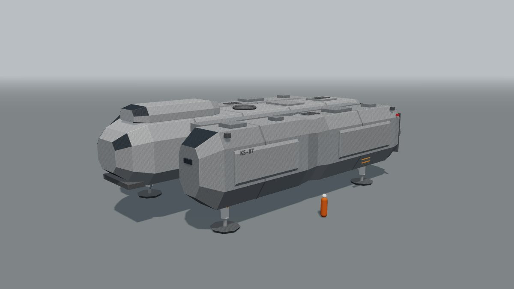
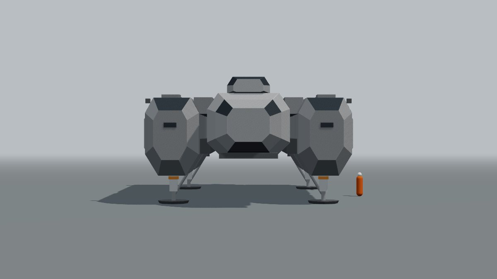
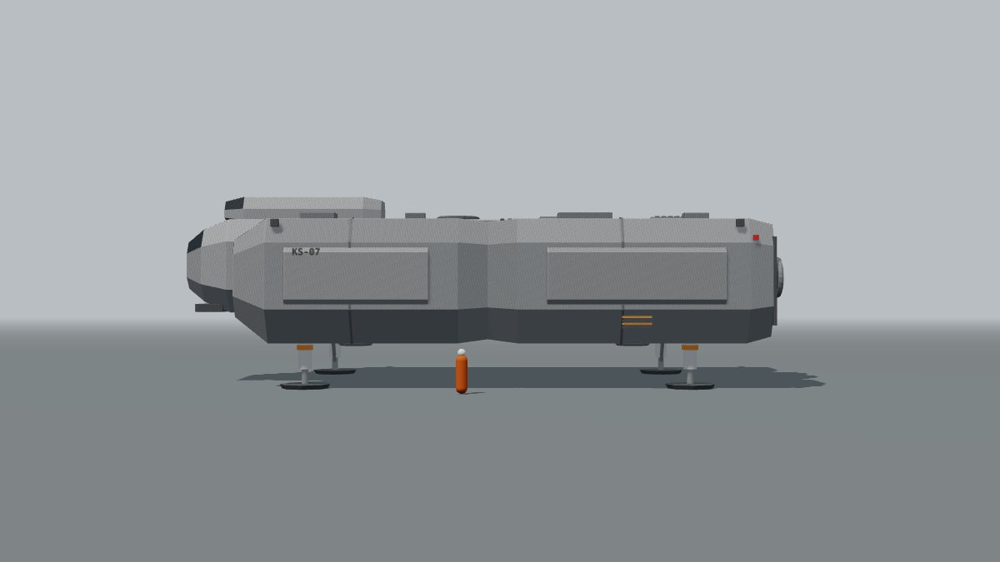
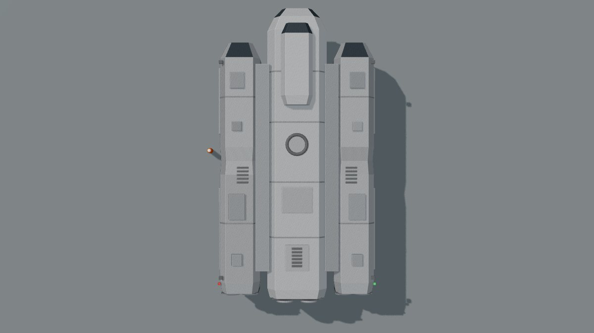
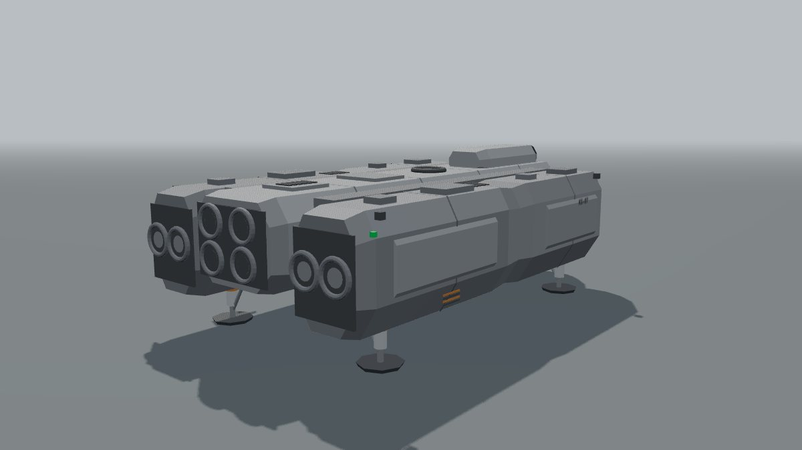

# Konsep Shuttle KS-07 v4 (badan tengah + dua nacelle)

Per 30 September 2026 · Status: konsep, menunggu persetujuan pemilik. v2b dan v3 tetap disimpan. Belum dipasang di game.

## Ringkasan

- v4 mengikuti tampak belakang gambar teknik referensi: badan tengah dengan 2 x 2 nosel, diapit dua nacelle samping yang masing-masing punya 2 nosel besar. Gaya pelat baja bersudut tajam dan bawah yang menyempit diambil dari foto.
- Simetris kiri-kanan, baja abu gelap dengan nada panel berbeda, tanda jingga sedikit, stensil KS-07 di sisi nacelle.
- Blokout bisa diputar di `docs/app/kestrel/blokout-ks07-v4.html` (seret = putar, 1-5 = sudut pandang).

## Referensi dan hak cipta

| Referensi | Yang diambil | Yang tidak diambil |
| --- | --- | --- |
| Gambar teknik tampak depan dan belakang | Susunan tiga blok dilihat dari belakang (nacelle, badan tengah, nacelle), jumlah dan letak nosel (2, 2 x 2, 2), kabin kokpit menonjol di tengah atas, perbandingan lebar dan tinggi yang lebar dan rendah | Ukuran persis tidak dipakai: gambar 22,8 m x 12,6 m, v4 diperkecil sekitar 0,6 supaya sesuai peran shuttle |
| Foto kendaraan pendarat | Pelat baja datar bersudut tajam, bawah menyempit, pintu bundar di punggung, warna baja abu | Foto ini kendaraan dari film. Sesuai aturan proyek, susunan empat pod terpisah di sudut badan tidak dipakai: di v4 tiap sisi berupa satu nacelle menerus dari depan sampai belakang |

Catatan: aturan "jangan meniru desain kendaraan film" ada di CLAUDE.md. Kalau pemilik ingin model yang lebih dekat ke kendaraan film (misalnya empat pod terpisah), aturan itu perlu diubah dulu oleh pemilik.

## Bagian-bagian

| No | Bagian | Posisi dan ukuran | Fungsi |
| --- | --- | --- | --- |
| 1 | Badan tengah | 25,4 m x 5,2 m x 4,1 m, bersudut tajam, hidung bersudut dengan jendela di bahu | Kabin awak dan kargo |
| 2 | Kabin kokpit | Di atas depan badan tengah, 7 m x 2,7 m, kaca di muka depan dan bahu | Kokpit dengan pandangan ke depan dan ke bawah |
| 3 | Dua nacelle | Kiri dan kanan, menerus 22 m, 3,5 m x 5,1 m, bawah menyempit, pinggang di tengah | Mesin utama, tangki, dan mesin angkat |
| 4 | Nosel belakang | Badan tengah 2 x 2, tiap nacelle 2 berdampingan | Dorongan maju |
| 5 | Nosel angkat | Dua di bawah tiap nacelle | Melayang dan mendarat |
| 6 | Pelat zirah | Pelat bersudut di sisi luar nacelle, sambungan panel melingkar | Perlindungan panas dan benturan, kulit |
| 7 | Punggung | Pintu bundar (sandar), pelat atas, kisi ventilasi, kotak peralatan di atas nacelle | Sandar di dermaga Copper, servis |
| 8 | Depan | Jendela sensor di muka nacelle, bibir dagu dengan lampu sorot | Pendaratan |
| 9 | Kaki pendarat | 4, di bawah nacelle | Tapak segi delapan 2,1 m, penopang miring |

## Ukuran (dari blokout)

| Ukuran | Nilai |
| --- | --- |
| Panjang | sekitar 25,7 m |
| Lebar (luar nacelle) | sekitar 13,8 m |
| Tinggi badan (bawah nacelle sampai atas kabin) | sekitar 6,4 m |
| Tinggi saat mendarat | sekitar 8,3 m |
| Jarak bawah nacelle ke tapak | 1,9 m; badan tengah 3,1 m (pemain bisa berjalan di bawah badan tengah) |

## Perbandingan versi

| Versi | Watak | Status |
| --- | --- | --- |
| v1 | Badan pengangkat membulat, sayap | Di game sekarang |
| v2b | Simetris, dua tingkat, empat rumah pendorong tegak | Disimpan |
| v3 | Garpu depan, blok belakang berat, lapuk | Disimpan |
| v4 | Badan tengah + dua nacelle menerus, baja gelap, bersudut tajam | Menunggu |

## Pilihan untuk pemilik

| No | Pertanyaan | Pilihan | Disarankan |
| --- | --- | --- | --- |
| 1 | Model untuk KS-07 | v2b / v3 / v4 | Pilihan pemilik |
| 2 | Skala v4 | a. Diperkecil 0,6 (lebar 13,8 m, cocok untuk dermaga Copper) · b. Sesuai gambar (lebar 22,8 m) | a |
| 3 | Warna v4 | a. Baja abu gelap · b. Lebih terang seperti v2b | a |

## Gambar

| Sudut | Gambar |
| --- | --- |
| 3/4 depan kiri |  |
| Depan |  |
| Samping kiri |  |
| Atas |  |
| 3/4 belakang kanan |  |

Catatan: ini blokout (bentuk dan tata letak), bukan tampilan akhir.
