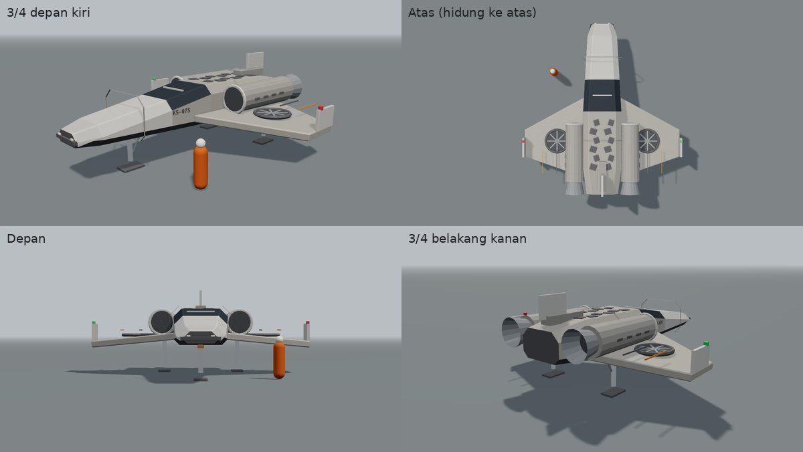
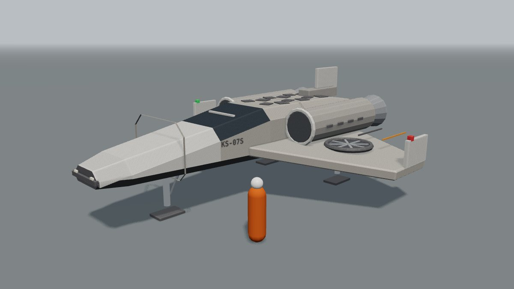
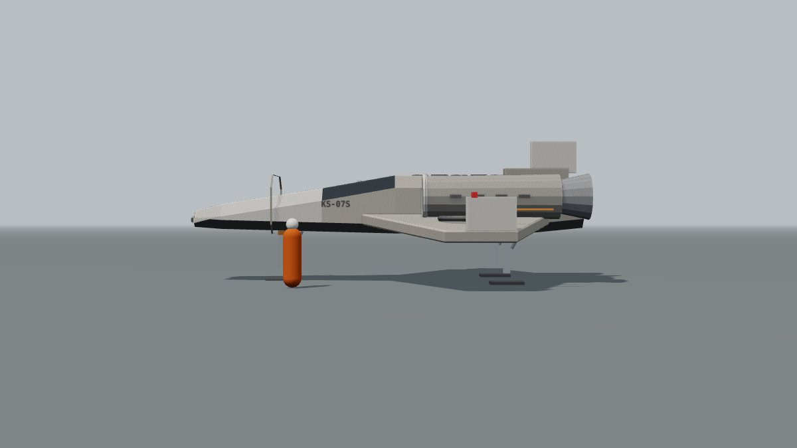
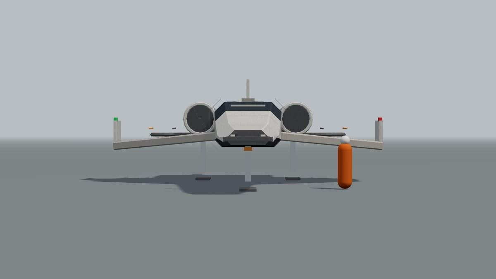
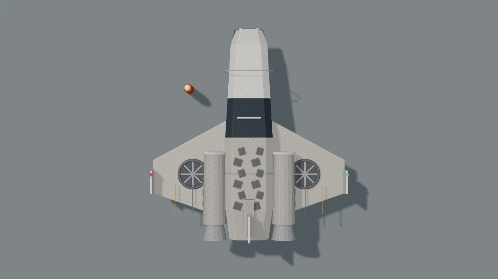
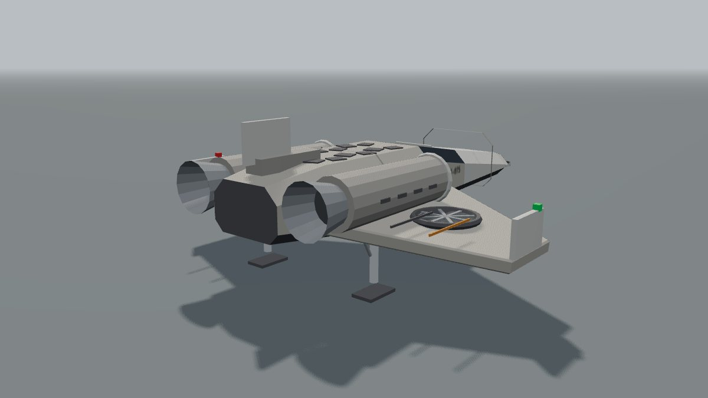

# Konsep KS-07 v5 (versi kecil dan lincah)

Per 30 September 2026 · Status: dipilih pemilik. Terpasang di Millar's World (`KESTREL.buildV5`, tahap M3d) dengan warna gelap doff, kotor, dan gosong. v3 disimpan.

## Ringkasan

- v5 adalah wahana kecil satu kursi, sekitar 10,8 m x 10,1 m (v3: 27,5 m x 9,9 m), supaya terasa lincah saat terbang di M3d.
- Satu keluarga dengan v3: abu-krem lapuk, garis jingga, badan bersudut. Badan baji dengan kokpit, panel berpola di punggung, sayap pendek menyapu dengan kipas angkat tertanam (untuk melayang dan mendarat di air), dua mesin di pangkal sayap, sirip kecil di ujung sayap, 3 kaki.
- Blokout bisa diputar di `docs/app/kestrel/blokout-ks07-v5.html` (seret = putar, 1-5 = sudut pandang).

## Referensi dan hak cipta

| Referensi | Yang diambil | Yang tidak diambil |
| --- | --- | --- |
| Sketsa hibrida (berlabel X-wing T-65) | Sifat umum: wahana kecil satu kursi, badan depan panjang terintegrasi, panel permukaan berpola, mesin bersaluran masuk di pangkal sayap | Sketsa ini berdasar kendaraan film. Sesuai aturan proyek, ciri khasnya tidak dipakai: sayap X empat bilah yang membuka, empat mesin, meriam di ujung sayap, robot di punggung. v5 memakai satu pasang sayap datar menyapu dengan kipas angkat, dua mesin, dan sirip kecil di ujung sayap |

## Bagian-bagian

| No | Bagian | Isi |
| --- | --- | --- |
| 1 | Badan | Baji bersudut 10,8 m, hidung datar lebar dengan bibir sensor dan dua lampu, kokpit satu kursi dengan kaca bersekat |
| 2 | Panel berpola | 12 ceruk bersudut gelap di punggung (kisi pendingin), dari sketsa |
| 3 | Sayap | Pendek, menyapu, sedikit menurun ke luar, bentang 10,1 m, garis jingga |
| 4 | Kipas angkat | Satu kipas bersaluran tertanam di tiap sayap, untuk melayang dan mendarat vertikal di air |
| 5 | Mesin | Dua mesin di pangkal sayap, saluran masuk berkipas di depan, nosel di belakang |
| 6 | Sirip ujung sayap | Kecil, dengan lampu navigasi merah (kiri) dan hijau (kanan) |
| 7 | Punggung belakang | Blok peralatan dan sirip kecil |
| 8 | Kaki | 3 (hidung + dua di bawah mesin), tapak lebar untuk air |

## Ukuran (dari blokout)

| Ukuran | v5 | v3 |
| --- | --- | --- |
| Panjang | 10,8 m | 27,5 m |
| Bentang / lebar | 10,1 m | 9,9 m |
| Tinggi saat mendarat | sekitar 4 m | sekitar 7,5 m |
| Awak | 1 | 2 + kargo |

Catatan untuk Millar: perut v5 hanya sekitar 1,35 m di atas tapak, jadi pemain tidak bisa berjalan di bawahnya. Naik lewat sisi kokpit (tangga lipat, ditambahkan saat dipasang).

## Pilihan untuk pemilik

| No | Pertanyaan | Pilihan | Disarankan |
| --- | --- | --- | --- |
| 1 | Peran v5 | a. Mengganti v3 di Millar (lincah untuk M3d) · b. Wahana tambahan: v3 tetap kapal induk yang mendarat, v5 dipakai untuk terbang · c. Simpan saja | b |
| 2 | Nama | a. KS-07S (varian kecil Kestrel) · b. Nama baru | a |

## Gambar

| Sudut | Gambar |
| --- | --- |
| 3/4 depan kiri |  |
| Samping kiri |  |
| Depan |  |
| Atas |  |
| 3/4 belakang kanan |  |

Catatan: ini blokout (bentuk dan tata letak), bukan tampilan akhir.
