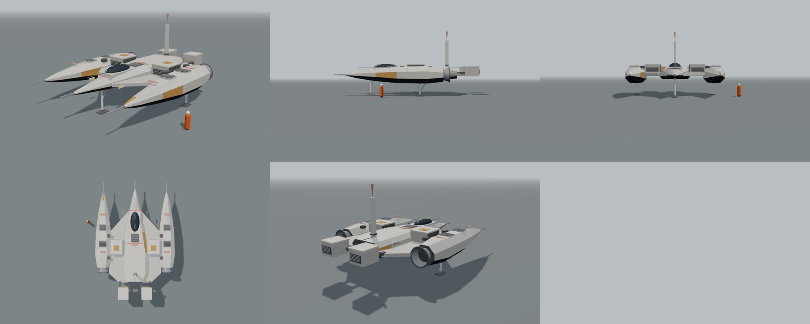
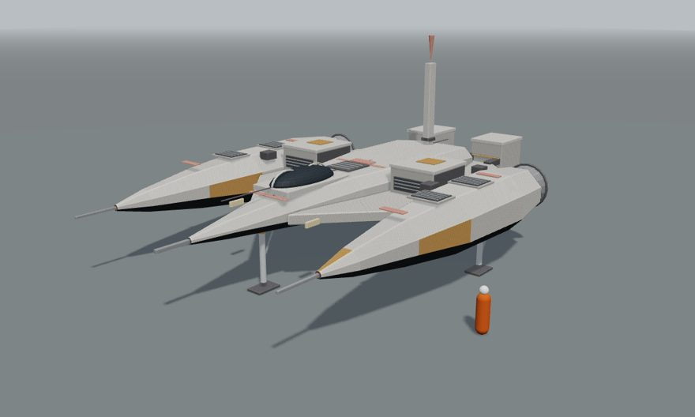
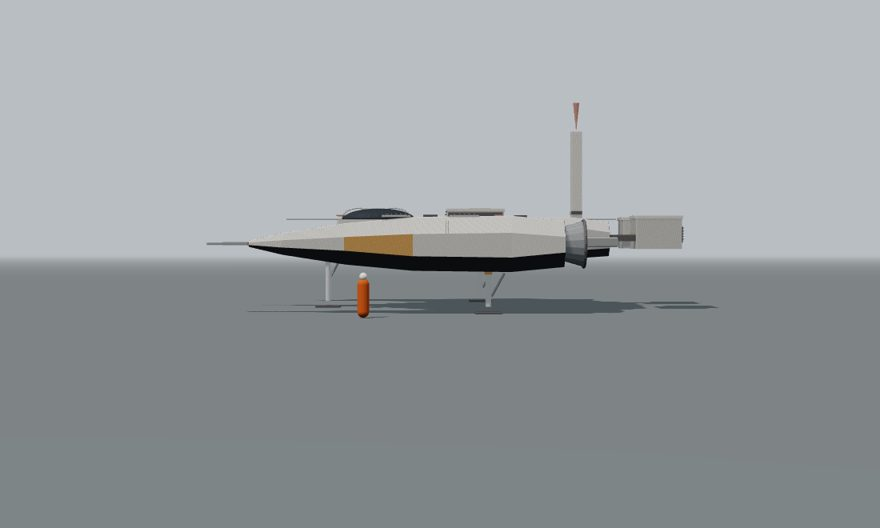
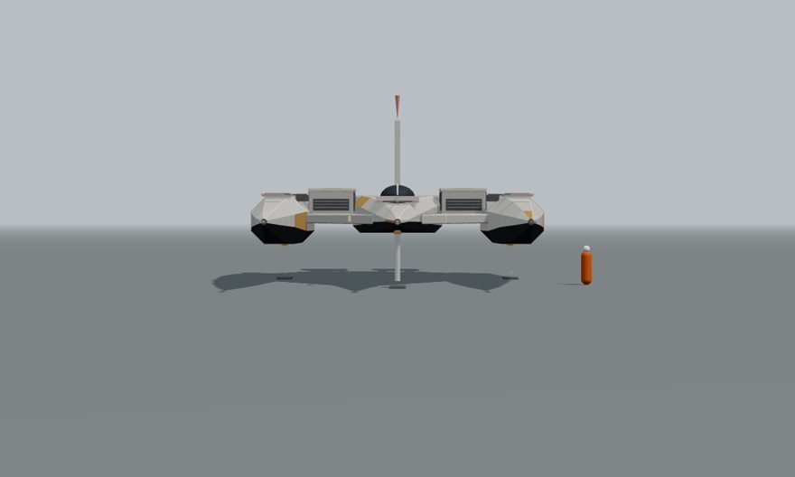
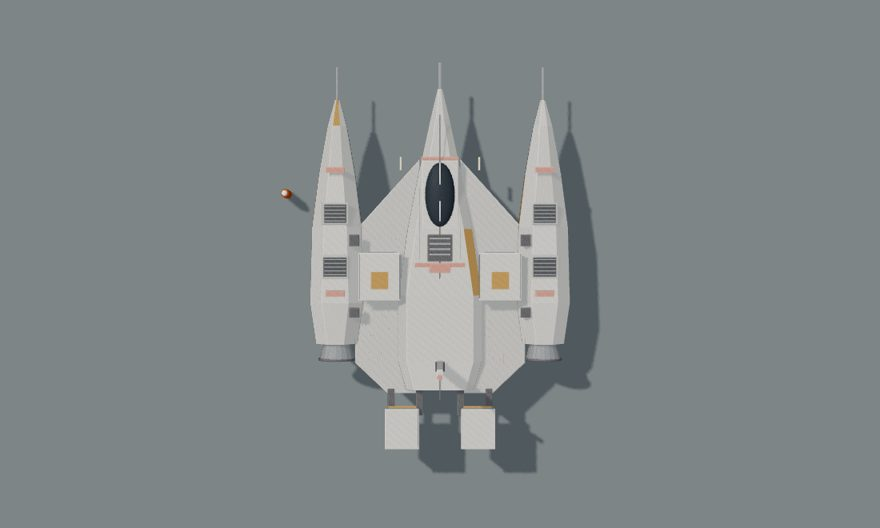
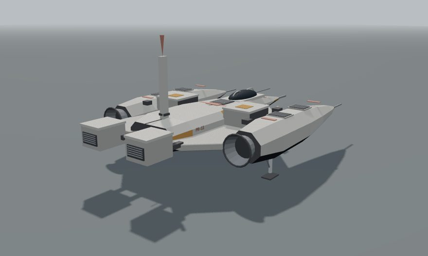

# Konsep Petrel PR-11 (wahana dua awak, putih lapuk)

Per 5 Oktober 2026 · Status: konsep blokout, menunggu persetujuan pemilik. Belum dipasang di experience mana pun. Wahana terpisah, bukan versi Kestrel; seri KS-07 (v2b sampai v5) tidak diubah.

## Ringkasan

- Nama: **Petrel PR-11**. Petrel = burung laut pengembara, cocok untuk wahana yang lincah di atas air (Millar's World) dan nama burung seperti Kestrel. Nama dan desain orisinal.
- Bentuk dari gambar 3D tampak atas dari pemilik: badan panah (delta) dengan kokpit gelembung, dek lebar berpanel, dua pod samping panjang meruncing dengan ujung probe, dua blok saluran masuk di dek, dua blok pendorong terpisah di belakang, satu tiang antena di punggung.
- Warna sengaja berbeda dari Kestrel (gelap doff): putih krem lapuk, bercak karat jingga, garis merah salem.
- Blokout bisa diputar di `docs/app/kestrel/blokout-petrel-pr11.html` (seret = putar, 1-5 = sudut pandang).

## Referensi dan hak cipta

| Referensi | Yang diambil | Yang tidak diambil |
| --- | --- | --- |
| Gambar 3D wahana dari pemilik (tampak atas, sumber stok, bukan kendaraan film yang dikenal) | Susunan umum: badan panah di tengah, dua pod panjang di sisi, dua blok di dek, dua blok kecil terpisah di belakang, tiang punggung, palet putih berkarat dengan garis salem | Detail permukaan (stiker, nomor, pelat) digambar ulang, tidak disalin. Bentuk badan, kokpit, panel, kaki, dan ukuran dibuat sendiri |

Catatan: tidak ada ciri kendaraan film (aturan di `CLAUDE.md`).

## Bagian-bagian

| No | Bagian | Isi |
| --- | --- | --- |
| 1 | Badan panah | Hidung runcing dengan lembing, melebar ke belakang, perut gelap, garis salem dan garis sambungan tengah |
| 2 | Kokpit | Gelembung kaca gelap di atas depan badan, dua rusuk bingkai, dua awak berurutan |
| 3 | Dek | Dua pelat delta kiri-kanan, ceruk panel gelap bersudut, noda karat, lampu sorot hangat di tepi |
| 4 | Blok saluran masuk | Dua kotak di dek, bukaan berbilah menghadap depan |
| 5 | Pod samping | Dua, menerus dari ujung probe sampai nosel, dua kisi ventilasi di punggung tiap pod, bercak karat |
| 6 | Pendorong terpisah | Dua blok berkisi di belakang, dipegang penopang pendek dari ujung badan |
| 7 | Nosel pod | Satu nosel bercincin di belakang tiap pod |
| 8 | Tiang antena | Punggung belakang, tinggi 4 m dengan ujung salem |
| 9 | Kaki | 3: satu di hidung, dua di bawah pod, tapak persegi |

## Ukuran (dari blokout, satuan m)

| Ukuran | Nilai |
| --- | --- |
| Panjang badan (hidung sampai belakang blok pendorong) | sekitar 19 |
| Panjang termasuk lembing dan probe | sekitar 21 |
| Lebar (luar pod) | sekitar 13,8 |
| Tinggi saat mendarat (tapak sampai ujung tiang) | sekitar 9,3 |
| Jarak bawah pod ke tapak | sekitar 1,75 |
| Awak | 2 |

Perbandingan: v5 10,8 x 10,1 m (1 awak), v3 27,5 x 9,9 m, v4 25,7 x 13,8 m.

## Pilihan untuk pemilik

| No | Pertanyaan | Pilihan | Disarankan |
| --- | --- | --- | --- |
| 1 | Peran | a. Wahana tambahan untuk Millar's World dan Copper (kelas menengah di antara v5 dan v3) · b. Pengganti v5 · c. Simpan saja | a |
| 2 | Nama | a. Petrel PR-11 · b. Nama lain | a |
| 3 | Langkah berikut | a. Jadikan `PETREL.build(THREE)` di `shared/` (warna per titik, kaca, kaki, nosel terpisah seperti `buildV5`) · b. Revisi blokout dulu | b bila bentuk perlu disempurnakan, lalu a |

## Gambar

| Sudut | Gambar |
| --- | --- |
| 3/4 depan kiri |  |
| Samping kiri |  |
| Depan |  |
| Atas |  |
| 3/4 belakang kanan |  |

Catatan: ini blokout (bentuk dan tata letak), bukan tampilan akhir.
