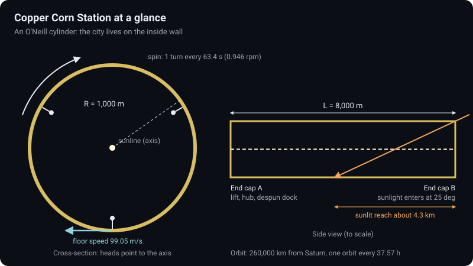
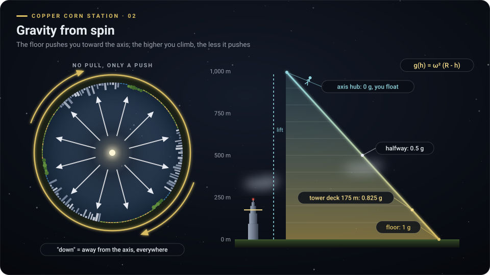
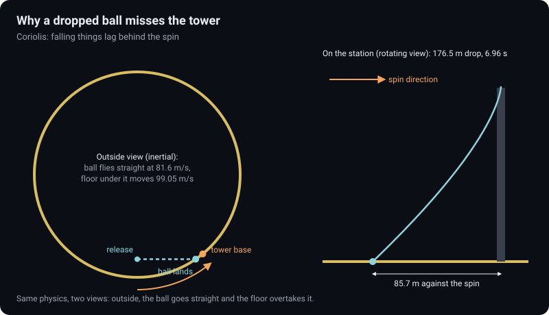
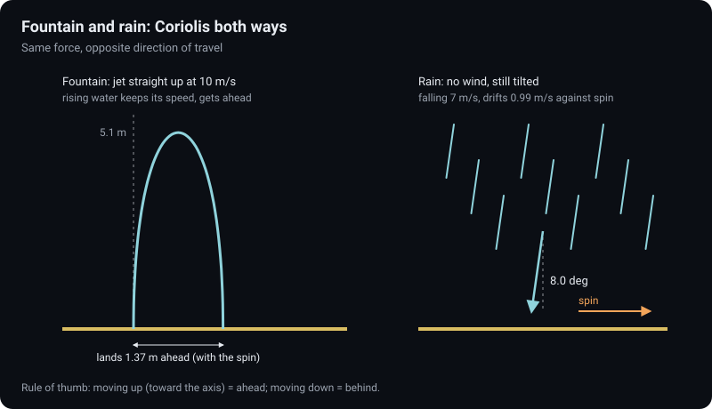
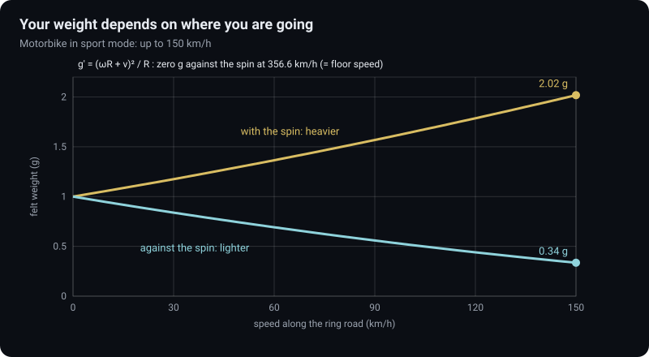
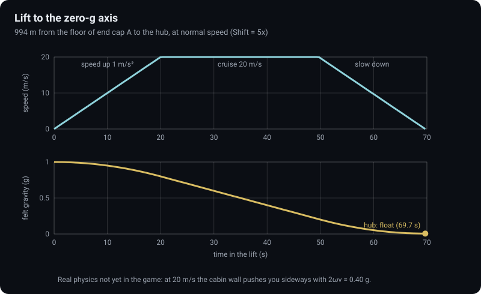
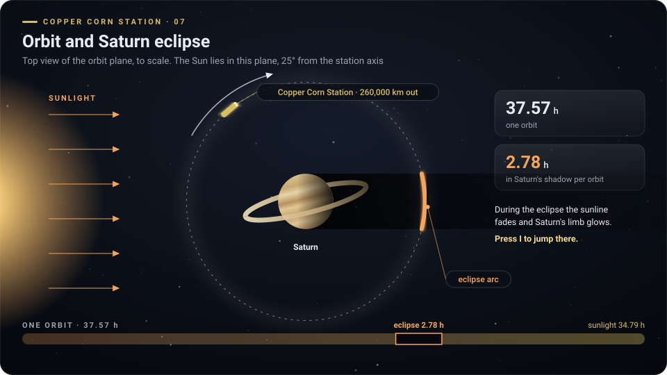
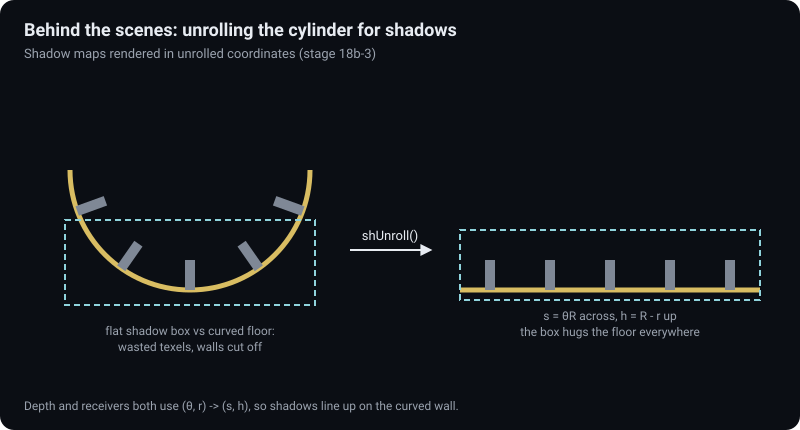
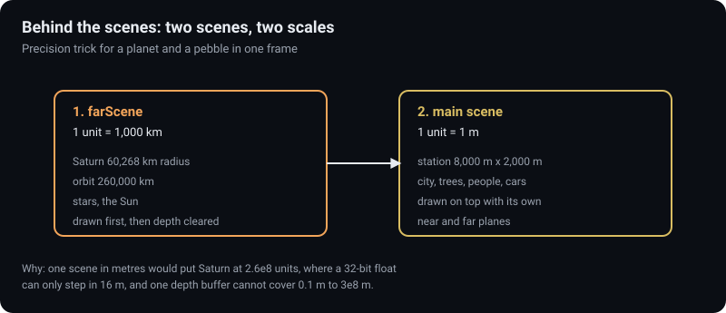

# Konsep halaman detail dan menu: Copper Corn Station

Per 9 Oktober 2026 · konsep, belum ada kode yang diubah. Pola ini nanti dipakai juga untuk Gargantua dan Millar's World.

## Ringkasan

- Tiap experience mendapat halaman detail sendiri `experiences/<id>/detail.html`: experience, fisika di baliknya, trik untuk dicoba, dan trik di balik layar, tiap bab dengan diagram.
- Menu utama tetap seperti sekarang; ditambah tombol "Pelajari" dan strip 3 fakta fisika per experience yang menautkan ke bab di halaman detail.
- Diagram berlabel English saja (satu gambar untuk kedua bahasa); teks halaman dua bahasa (ID sumber, EN). 9 sketsa diagram Copper sudah dibuat di `gambar/`.

## 1. Arsitektur halaman

| Bagian | Keputusan | Alasan |
| --- | --- | --- |
| Lokasi | `experiences/<id>/detail.html`, halaman mandiri | Sama dengan aturan aplikasi: tiap halaman terpisah, tanpa build, jalan dari file:// |
| Bahasa | `?lang=id|en` + localStorage `lazarus.lang`, teks di konstanta data dengan field `en` (pola `SPOTS` / `FEATS` di `index.html`) | Seragam dengan menu dan experience |
| Diagram | SVG inline di halaman, label English; bab 2, 4, 5 diberi slider (pola kalkulator radius di menu) | Satu gambar untuk dua bahasa, tanpa kamus diagram |
| Navigasi | Daftar bab melekat di atas (ponsel) / kiri (desktop), tautan bab `#gravitasi`, `#coriolis`, dst. | Menu bisa menautkan langsung ke satu bab |
| Tautan | Kembali ke `../../index.html?lang=`, tombol Mulai ke `index.html?lang=` experience | Aturan aplikasi: tiap halaman punya tautan kembali |
| Gaya | Token warna menu (`--cu` #d9bd62 untuk Copper, latar gelap), font sistem | Terasa satu aplikasi dengan menu |
| Bahan | File .md di `docs/<id>/detail/` (seperti `fisika-coriolis.md`) = bahan teks; dipindah ke data halaman saat implementasi | Pemilik membaca dan merevisi di ponsel dulu |

### Perubahan di menu utama (`index.html`)

| Tambahan | Isi | Yang tidak berubah |
| --- | --- | --- |
| Tombol "Pelajari" / "Learn more" | Di samping tombol Mulai pada tiap bagian, ke `experiences/<id>/detail.html` | Foto beranotasi, `SPOTS`, `STATS`, kalkulator, `FEATS`, `KEYS` |
| Strip "3 fakta fisika" | 3 kartu kecil di bawah `FEATS`, tiap kartu: satu angka + satu kalimat + tautan bab | Urutan bagian dan hero |
| Data | Konstanta baru `FACTS = { c: [...], g: [...], m: [...] }` dengan field `en` | `APP`, `EXPERIENCES`, `TXT` (hanya ditambah kunci baru) |

Usulan 3 fakta Copper:

| Fakta | ID | EN | Tautan |
| --- | --- | --- | --- |
| 85,7 m | Bola dijatuhkan dari dek 175 m mendarat 85,7 m dari kaki menara | A ball dropped from the 175 m deck lands 85.7 m from the tower | `#coriolis` |
| 0,34 g | Naik motor 150 km/h melawan putaran, beratmu tinggal sepertiga | Ride at 150 km/h against the spin and you weigh a third | `#berat` |
| 0 g | Naik lift 994 m ke sumbu, gravitasi memudar sampai kamu melayang | Ride the lift 994 m to the axis and gravity fades until you float | `#lift` |

## 2. Struktur halaman detail Copper

Tiap bab: inti satu kalimat (ID + EN), diagram, tabel angka, kotak "Coba sendiri" dengan tombol.

| No | Bab (anchor) | Diagram | Interaktif nanti |
| --- | --- | --- | --- |
| 1 | Stasiun sekilas `#stasiun` | `cc-01-station.svg` | Tidak |
| 2 | Gravitasi dari putaran `#gravitasi` | `cc-02-spin-gravity.svg` | Slider ketinggian: g di titik itu |
| 3 | Coriolis: bola jatuh `#coriolis` | `cc-03-coriolis-drop.svg` | Animasi dua kerangka berdampingan |
| 4 | Air mancur dan hujan `#airmancur` | `cc-04-fountain-rain.svg` | Slider kecepatan semburan |
| 5 | Berat saat bergerak `#berat` | `cc-05-moving-weight.svg` | Slider kecepatan + arah |
| 6 | Lift ke sumbu `#lift` | `cc-06-lift.svg` | Penanda waktu bergerak di grafik |
| 7 | Orbit dan gerhana `#gerhana` | `cc-07-orbit-eclipse.svg` | Stasiun berjalan di orbit |
| 8 | Trik untuk dicoba `#coba` | (tabel) | Tidak |
| 9 | Di balik layar `#teknik` | `cc-08-unrolled-shadow.svg`, `cc-09-two-scenes.svg` | Tidak |

### Bab 1. Stasiun sekilas

| | Teks |
| --- | --- |
| ID | Silinder 8 km berjari-jari 1 km mengorbit Saturnus. Kota, ladang, dan sungai ada di dinding dalam, dan kepala semua orang menghadap sumbu. |
| EN | An 8 km cylinder with a 1 km radius orbits Saturn. City, fields and river line the inside wall, and everyone's head points at the axis. |

| Angka | Nilai | Sumber |
| --- | --- | --- |
| Radius / panjang | 1.000 m / 8.000 m | CLAUDE.md Angka dasar |
| Putaran | 63,4 s per putaran, 0,946 rpm | omega = akar(g / R) = 0,09905 rad/s |
| Kecepatan lantai | 99,05 m/s (356,6 km/h) | omega x R |
| Jangkauan sinar Matahari | sekitar 4,3 km dari end cap B | 2R / tan 25 derajat = 4.289 m (sinar masuk di tepi end cap) |
| Orbit | 260.000 km, 37,57 jam | `ORBIT.r`, 2 pi akar(r^3 / GM Saturnus) |

### Bab 2. Gravitasi dari putaran

| | Teks |
| --- | --- |
| ID | Tidak ada tarikan ke bawah. Lantai yang berputar terus mendorongmu ke arah sumbu, dan dorongan itu terasa sebagai berat. Makin tinggi, makin ringan. |
| EN | Nothing pulls you down. The spinning floor keeps pushing you toward the axis, and that push feels like weight. The higher you go, the lighter you get. |

| Ketinggian | Gravitasi | Rumus g(h) = omega^2 (R - h) |
| --- | --- | --- |
| Lantai | 1,000 g | |
| Kepala (1,8 m) | 0,998 g | beda kepala-kaki 0,18% |
| Dek menara 175 m | 0,825 g | |
| 500 m | 0,500 g | |
| Hub di sumbu | 0 g | |

Coba sendiri: dek pandang (panel atau E di lobi menara), lift L.

### Bab 3. Coriolis: bola yang meleset dari menara

| | Teks |
| --- | --- |
| ID | Dari luar, bola terbang lurus. Ia hanya membawa 81,6 m/s, sedangkan lantai di bawahnya bergerak 99,05 m/s, jadi lantai menyalip dan bola mendarat 85,7 m di belakang menara. |
| EN | Seen from outside, the ball flies straight. It carries only 81.6 m/s while the floor below moves at 99.05 m/s, so the floor overtakes it and the ball lands 85.7 m behind the tower. |

| Angka | Nilai | Derivasi |
| --- | --- | --- |
| Tinggi lepas | 176,5 m | dek 175 m + tangan 1,5 m (`PHYS.handH`) |
| Waktu jatuh | 6,96 s | jarak garis singgung akar(R^2 - r0^2) / (omega r0) |
| Meleset | 85,7 m melawan putaran | sama dengan catatan peta `MAP_MARKS` D di kode |

Isi lengkap: `fisika-coriolis.md` bagian 1 dan 3.

### Bab 4. Air mancur dan hujan: Coriolis dua arah

| | Teks |
| --- | --- |
| ID | Air yang naik membawa kecepatan lantai ke tempat yang butuh lebih sedikit, jadi ia mendahului lantai. Hujan yang turun tertinggal, jadi miring 8 derajat walau tanpa angin. |
| EN | Rising water carries the floor's speed to where less is needed, so it gets ahead. Falling rain lags behind, so it tilts 8 degrees even without wind. |

| Kasus | Angka | Rumus / sumber |
| --- | --- | --- |
| Semburan 10 m/s | puncak 5,1 m, mendarat 1,37 m searah putaran | (4/3) omega v^3 / g^2, sama dengan `FOUNT_TEXT` |
| Hujan | jatuh 7 m/s, hanyut 0,99 m/s, miring 8,0 derajat | `RAIN.vlat` = 2 omega vt^2 / g, atan(0,99 / 7) |
| Aturan praktis | naik = mendahului, turun = tertinggal | `fisika-coriolis.md` |

Coba sendiri: tombol 9 (air mancur, E di plakat), N sampai mendung tebal untuk hujan.

### Bab 5. Berat berubah saat bergerak

| | Teks |
| --- | --- |
| ID | Searah putaran, kamu menambah kecepatan keliling dan jadi lebih berat. Melawan putaran, kamu menguranginya dan jadi lebih ringan. |
| EN | Going with the spin adds to your circling speed and makes you heavier. Going against it takes speed away and makes you lighter. |

| Kecepatan motor | Searah putaran | Melawan putaran |
| --- | --- | --- |
| 50 km/h | 1,30 g | 0,74 g |
| 100 km/h | 1,64 g | 0,52 g |
| 150 km/h | 2,02 g | 0,34 g |
| 356,6 km/h (kecepatan lantai) | 4,00 g | 0 g |

Rumus g' = (omega R + v)^2 / R. Baris 356,6 km/h hanya hitungan; motor dibatasi 150 km/h.

Coba sendiri: C naik motor di jalan cincin, Shift untuk sport.

### Bab 6. Lift ke sumbu nol-g

| | Teks |
| --- | --- |
| ID | Lift naik 994 m sepanjang dinding end cap A. Gravitasi turun lurus dengan ketinggian, sampai di hub kamu melayang. |
| EN | The lift climbs 994 m up the wall of end cap A. Gravity falls steadily with height until you float at the hub. |

| Angka | Nilai | Sumber |
| --- | --- | --- |
| Jarak | 994 m | R - `LIFT.topR` (6 m) |
| Profil | percepatan 1 m/s^2, maksimal 20 m/s | `LIFT.accel`, `LIFT.maxSpeed`, `stepLift()` |
| Waktu tempuh | 69,7 s (Shift = 5x lebih cepat) | 20 s naik kecepatan + 29,7 s jelajah + 20 s melambat |
| Dorongan samping (fisika nyata) | 2 omega v = 3,96 m/s^2 = 0,40 g pada 20 m/s | Belum dimodelkan di game (`stepLift()` hanya mengubah posisi); bisa jadi usulan |

Coba sendiri: L atau E di kaki lift, lalu hub dan kapsul ke dermaga despun.

### Bab 7. Orbit dan gerhana Saturnus

| | Teks |
| --- | --- |
| ID | Sekali tiap orbit 37,57 jam, stasiun lewat di bayangan Saturnus selama 2,78 jam. Sunline padam dan tepi atmosfer Saturnus menyala. |
| EN | Once every 37.57 h orbit, the station passes through Saturn's shadow for 2.78 h. The sunline fades and Saturn's limb glows. |

| Angka | Nilai | Sumber |
| --- | --- | --- |
| Lama gerhana | 2,78 jam | Terukur di `tools/uji_gerhana.py`; hitung kasar 2 asin(Req / r) x periode = 2,80 jam |
| Sudut Matahari | 25 derajat dari sumbu, masuk lewat end cap B | `SUN_AXIS_DEG` |

Coba sendiri: I lompat ke gerhana berikutnya.

### Bab 8. Trik untuk dicoba

| Trik | Cara | Yang terjadi |
| --- | --- | --- |
| Bola meleset dari menara | Dek pandang, G (jatuhkan) | Mendarat 85,7 m melawan putaran |
| Bola menabrak menara | Dek, lepas ke arah searah putaran | Bola melenceng ke belakang dan menabrak menara |
| Lempar jauh | B ke arah melawan putaran | Bola lebih ringan (0,64 g pada 20 m/s), terbang lebih jauh |
| Motor ringan dan berat | C, jalan cincin, 150 km/h dua arah | 2,02 g vs 0,34 g |
| Air mancur Coriolis | 9, E di plakat | Semburan mendarat 1,37 m searah putaran |
| Hujan miring | N sampai mendung | Hujan miring 8 derajat tanpa angin |
| Melayang di sumbu | L, lalu hub | 0 g, melayang bebas |
| Gerhana | I | Sunline padam 2,78 jam |
| Silinder dari luar | V kamera luar, M peta hologram | Kerangka inersia, peta 3D tembus pandang |
| Foto | F kamera rangefinder | Lensa 21-90 mm, foto akumulasi |

### Bab 9. Di balik layar

| Trik | Masalah | Cara di kode | Angka |
| --- | --- | --- | --- |
| Dua scene, dua skala | Satu depth buffer tidak cukup untuk kerikil 0,25 m dan Saturnus 3,2 x 10^8 m (rasio jauh / dekat 1,3 miliar, permukaan berkedip) | `farScene` + `farCam` (1 unit = 1.000 km, dekat 1 sampai jauh 20.000 unit) digambar dulu, depth dikosongkan, lalu scene utama `camera` dalam meter (0,25 m sampai 12 km) | Rasio kamera utama 48.000 : 1 |
| Kerangka berputar | Di dalam stasiun dunia diam; dari luar dunia berputar | Kamera luar dan pesawat di kerangka inersia: `scene.rotation.z = omega t` | 1 putaran / 63,4 s |
| Bayangan di silinder | Kotak bayangan datar memotong lantai lengkung | `shUnroll()`: kedalaman dan penerima dihitung di koordinat silinder terbuka (s = theta R, h = R - r) | Tahap 18b-3 |
| Pantulan tanpa langit biru | Kaca dan air di dalam silinder memantulkan daratan seberang, bukan langit | `farEnv()` di `LIGHT_GLSL` | Tahap 17b, 17d |
| Bangun datar lalu tekuk | Lapangan baseball, terminal harus ikut lengkung | `ballparkModel()`, `bendCyl()` | Tahap 12d+, 24c |
| Tanah sama di CPU dan GPU | Pemain dan shader harus setuju tinggi tanah | Heightmap half-float `TER`, nilai sama di kedua sisi | Tahap 20c |
| Lalu lintas | Ribuan mobil antre tanpa membebani GPU | Simulasi IDM di CPU `stepTraffic()`, posisi dikirim sebagai atribut `aSim` | Tahap 12b-1 |
| Pohon jauh | Pohon jauh dilihat dari atas tampak lembaran tipis | Impostor oktahedral `OCT` 8 x 8 arah | Tahap V5 |
| Bayangan hemat | Pass bayangan menggambar seluruh kota | `SHP` hanya menggambar yang jatuh di kotak bayangan | 1,93 juta -> 0,50 juta segitiga per frame (tahap 20d) |

## 3. Daftar diagram

Dibangkitkan oleh `tools/diagram_detail_copper.py` (Python, tanpa library luar); bentuk lintasan dan grafik dihitung dari rumus, bukan digambar tangan. Gaya (revisi 2): 960 x 540 (16:9), latar bintang, gradien dan glow beraksen emas Copper, ilustrasi kota di dinding dalam, lintasan stroboskop (bola, menara, kabin lift), kartu angka besar, label pil. Tanpa font atau gambar luar, jadi tampil sama di GitHub dan di halaman.

| File | Bab | Menunjukkan |
| --- | --- | --- |
| `cc-01-station.svg` | 1 | Penampang + tampak samping berskala, sinar Matahari 25 derajat |
| `cc-02-spin-gravity.svg` | 2 | "Bawah" menjauhi sumbu, grafik g vs ketinggian |
| `cc-03-coriolis-drop.svg` | 3 | Bola dari dek: kerangka inersia dan kerangka berputar |
| `cc-04-fountain-rain.svg` | 4 | Lintasan semburan 10 m/s (skala nyata), hujan miring 8 derajat |
| `cc-05-moving-weight.svg` | 5 | g' vs kecepatan, searah dan melawan putaran |
| `cc-06-lift.svg` | 6 | Kecepatan dan gravitasi selama 69,7 s di lift |
| `cc-07-orbit-eclipse.svg` | 7 | Orbit berskala, bayangan Saturnus, busur gerhana |
| `cc-08-unrolled-shadow.svg` | 9 | Kotak bayangan datar vs silinder dibuka |
| `cc-09-two-scenes.svg` | 9 | farScene dan scene utama |

## 4. Pola untuk experience lain

| Bab | Gargantua | Millar's World |
| --- | --- | --- |
| Sekilas | Bayangan, horizon, ISCO, relai 22 rs | Laut dangkal 1,3 g, gelombang 1,2 km |
| Fisika 1 | Cahaya dibelokkan (lensa) | Dilatasi waktu 1 jam = 7 tahun |
| Fisika 2 | Jatuh ke horizon, jam membeku | Gelombang pasang dan arus surut |
| Fisika 3 | Gas 0,8 c di ISCO, aberasi | Gravitasi 1,3 g, lompat 77% |
| Trik dicoba | Suar ke relai, autopilot susur, tesseract | Radar, lolos sebelum gelombang |
| Di balik layar | Penelusuran sinar di shader, peta corong | Ombak FFT di GPU, langit cubemap |

Rumus Gargantua sudah ada di `docs/gargantua/rumus-peta-corong.md` dan `rumus-pandangan-relai.md`.

## 5. Tahap implementasi

| Tahap | Isi | File | Effort | Model | Thinking |
| --- | --- | --- | --- | --- | --- |
| D1 | `detail.html` Copper: kerangka, navigasi bab, data teks ID / EN, SVG inline | `experiences/cooper-station/detail.html` | Medium | Sonnet 5.5 | medium |
| D2 | Diagram interaktif (slider bab 2, 4, 5; animasi bab 3, 6, 7) | `detail.html` | Medium | Sonnet 5.5 | medium |
| D3 | Tombol Pelajari + strip `FACTS` di menu | `index.html` | Low | Haiku 4.5 | low |
| D4 | Cek termuat tanpa error dan kamus EN lengkap | `tools/qc_load.py` | Low | Haiku 4.5 | low |

## Status

| Tahap | Status | Catatan |
| --- | --- | --- |
| D1 | Selesai | `experiences/cooper-station/detail.html`, teks ID + EN |
| D2 | Selesai | Simulasi interaktif di semua bab fisika (lihat di bawah) |
| D3 | Sebagian | Tombol "Pelajari fisikanya" di bagian Copper menu; strip `FACTS` belum |
| D4 | Selesai | `tools/uji_detail_copper.cjs` (22 cek lulus) |

Revisi dari screenshot Bhakti: tombol tanpa garis bawah (detail dan menu), toggle hero jadi "Dilihat dari luar / dari dalam" dengan keterangan dan jejak bintang, bab 9 Di balik layar dan kuis tebak Coriolis dihapus (ditunda).

Isi interaktif yang dibangun (lebih dari rencana awal):

| Bab | Interaksi |
| --- | --- |
| Hero | Penampang berputar dengan kecepatan asli 63,4 s; "Dari lantai" = kerangka ikut berputar, bintang yang berputar |
| 2 Gravitasi | Slider / klik ketinggian; massa pengguna -> angka timbangan, tinggi lompatan, waktu jatuh cangkir |
| 3 Coriolis | Tebak dulu (depan / bawah / belakang), lalu dua panel bersamaan (inersia dan berputar) dari lintasan tepat; 6 preset termasuk "dari puncak lift" (16,8 menit, stasiun berputar 15,9 kali, lintasan spiral) |
| 4 Air mancur dan hujan | Slider kecepatan semburan (hitungan tepat vs rumus pendekatan) dan kecepatan tetes (gerimis sampai deras) |
| 5 Berat | Jalan cincin dilihat dari sumbu, putaran stasiun kecepatan asli, slider -400 sampai +400 km/h, pengukur g |
| 6 Lift | Naik / turun, Shift 5x, unting-unting dan arah "bawah" terasa di kabin, orang terangkat ke langit-langit saat rem lebih kuat dari gravitasi |
| 7 Gerhana | Slider waktu orbit, putar, lompat ke gerhana (seperti tombol I), garis waktu satu orbit |
| 8 Paspor | 10 eksperimen dengan cap (tersimpan di browser) |
| 9 Di balik layar | Slider morf silinder dibuka dengan persen texel terpakai, 8 trik, diagram dua scene |
| Galeri | 9 diagram dengan lightbox |

Temuan saat membangun: hitungan tepat semburan 10 m/s = 1,36 m; plakat di game memakai rumus pendekatan (4/3) omega v^3 / g^2 = 1,37 m. Halaman menyebut keduanya.

## Catatan dan batasan

- Angka di dokumen ini dihitung ulang dengan Python dari R 1.000 m dan g 9,81 m/s^2; semua cocok dengan `fisika-coriolis.md` dan teks di kode (85,7 m, 1,37 m, 8 derajat, 0,825 g).
- Lama gerhana 2,78 jam adalah hasil terukur uji; hitungan kasar memberi 2,80 jam. Halaman memakai 2,78.
- Dorongan samping 0,40 g di lift adalah fisika nyata yang belum ada di game; di halaman ditandai jelas, atau dijadikan usulan fitur.
- "Di atas sekitar 2 rpm banyak orang pusing" adalah pedoman umum desain habitat berputar, bukan angka dari kode.
- Tidak memakai judul, logo, musik, atau desain kendaraan film; semua diagram orisinal.
