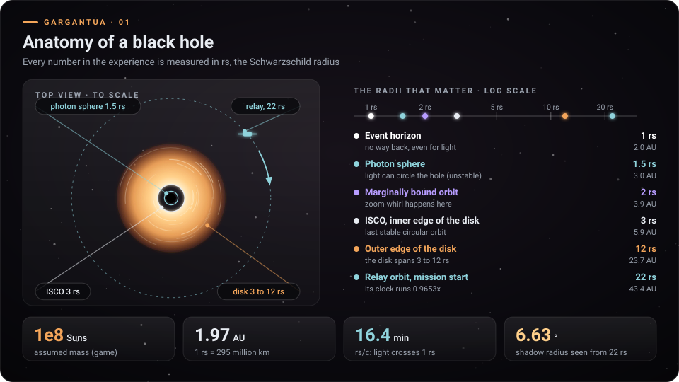
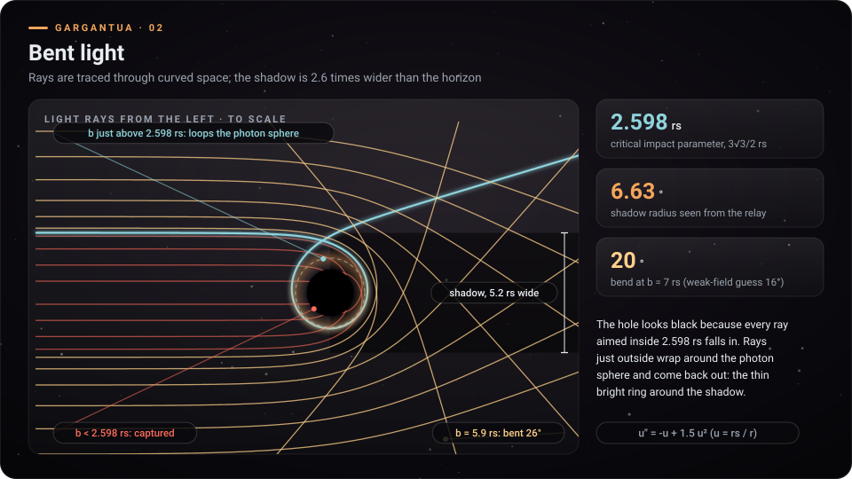
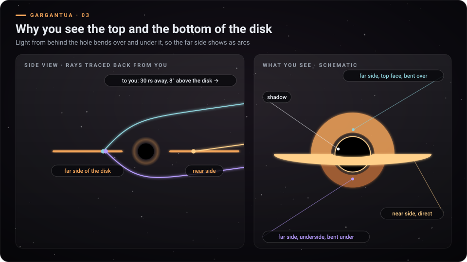
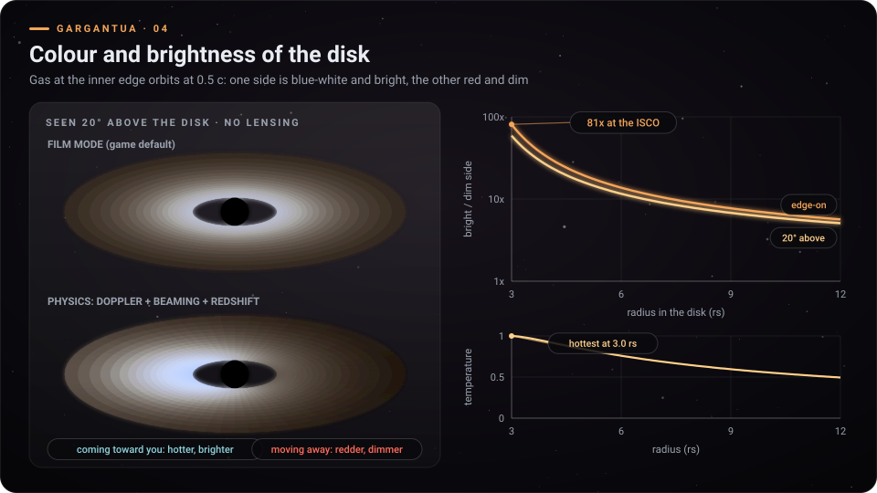
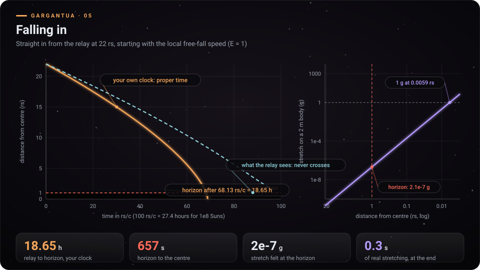
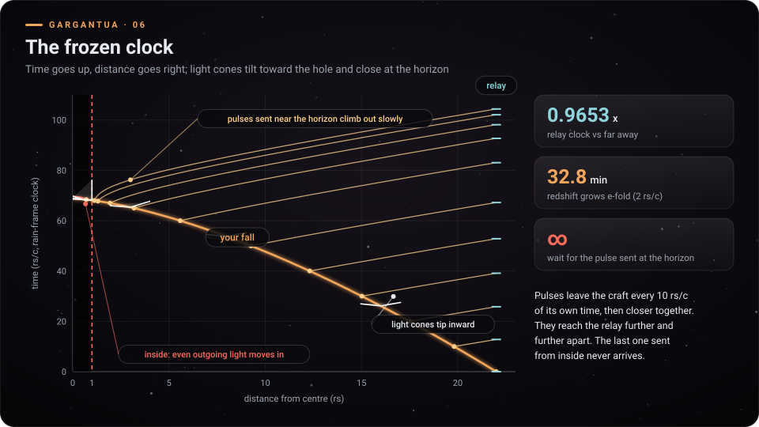
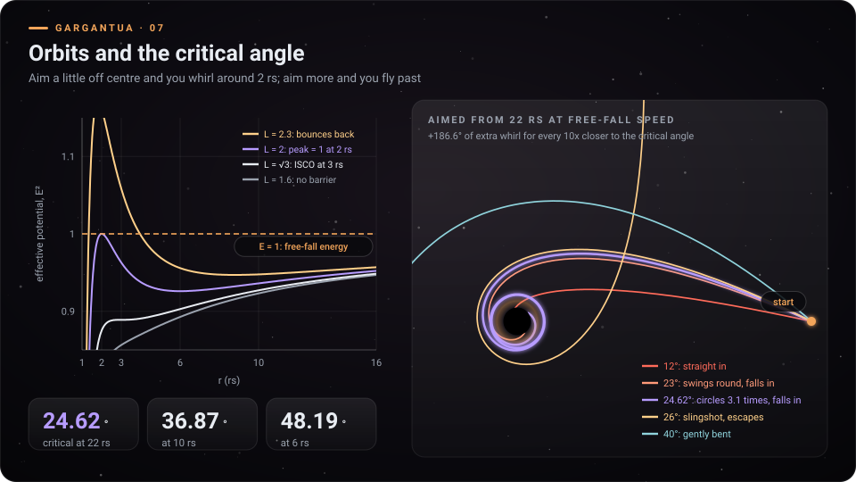
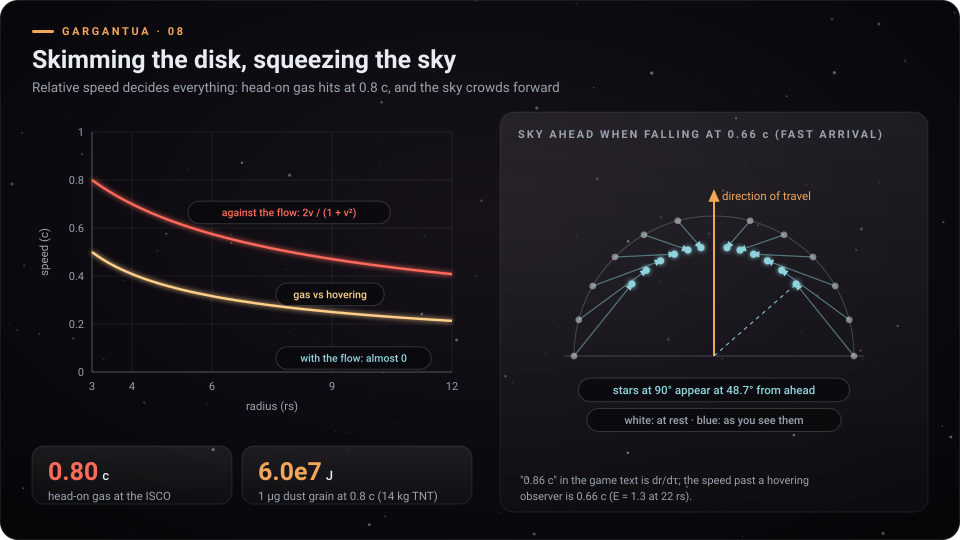

# Konsep halaman detail: Gargantua

Per 9 Oktober 2026 · konsep, belum ada kode halaman yang diubah. Mengikuti pola halaman detail Copper (`docs/cooper-station/detail/konsep-halaman-detail.md`, sudah jadi di `experiences/cooper-station/detail.html`).

## Ringkasan

- Halaman `experiences/gargantua/detail.html`: 7 bab fisika plus paspor trik, masing-masing dengan diagram dan simulasi kecil. Bab "Di balik layar" ditunda, seperti di Copper.
- Diagram berlabel English (8 diagram sudah dibuat di `gambar/`). Teks halaman dua bahasa, ID sebagai sumber dan EN sebagai terjemahan. Semua angka dihitung ulang dengan rumus yang sama dengan kode game, dan generator berhenti bila ada angka yang tidak cocok.
- Hal yang harus jujur di halaman:
  - Experience memakai Schwarzschild (tanpa putaran), bukan Kerr.
  - Mode film bawaan tidak menampilkan Doppler.
  - Tesseract adalah fiksi.

## 1. Arsitektur halaman

| Bagian | Keputusan |
| --- | --- |
| Lokasi | `experiences/gargantua/detail.html`, satu file tanpa library, jalan dari file:// |
| Bahasa | Kamus `S = { key: [id, en] }` + `T()`, `?lang=` dan localStorage `lazarus.lang` (sama dengan detail Copper) |
| Kanvas | Pola Copper: `panel(id, draw, step)` + satu `loop()` yang hanya menjalankan panel terlihat; tetap beranimasi walau prefers-reduced-motion (keputusan Bhakti untuk Copper) |
| Warna | Aksen `--ga` #f3a55a (jingga menu), latar hampir hitam, biru muda untuk cahaya dan relai, ungu untuk orbit dan pasang surut |
| Satuan | rs dan rs/c di semua simulasi; jam, menit, dan km ditampilkan untuk massa 1e8 Matahari (asumsi game) |
| Navigasi | Tautan kembali `../../index.html?lang=`, tombol Mulai ke `index.html?lang=` |
| Gambar | Salinan `gg-*.svg` di `experiences/gargantua/detail/` untuk galeri |

### Perubahan di menu utama (`index.html`)

| Tambahan | Isi |
| --- | --- |
| Tombol Pelajari | Salin anchor `.learn` milik Copper ke bagian Gargantua dengan `data-x="gargantua"` dan `<small data-t="g_learn">`. `render()` sudah generik, jadi tidak perlu diubah |
| Teks | `g_learn`: "Cahaya dibelokkan, jam membeku, sudut kritis, simulasi interaktif" / "Bent light, frozen clocks, the critical angle, interactive simulations" |
| `FACTS.g` (bila strip fakta jadi dibuat) | 3 fakta di bawah |

| Fakta | ID | EN | Tautan |
| --- | --- | --- | --- |
| 18,65 jam | Jatuh dari relai ke horizon makan 18,65 jam menurut jammu, tetapi dari horizon ke pusat hanya 657 detik | Falling from the relay to the horizon takes 18.65 hours on your clock, then just 657 seconds from the horizon to the centre | `#jatuh` |
| 81x | Sisi piringan yang datang ke arahmu 81 kali lebih terang daripada sisi yang menjauh | The side of the disk coming toward you is 81 times brighter than the side moving away | `#piringan` |
| 24,62° | Bidik 24,62 derajat dari arah pusat dan wahana berputar-putar di 2 rs sebelum jatuh | Aim 24.62 degrees off centre and the craft whirls around 2 rs before it falls | `#orbit` |

## 2. Struktur halaman

Tiap bab berisi:
- inti satu kalimat (ID + EN);
- simulasi kanvas;
- tabel angka;
- kotak "Coba di game" berisi tombol dan skenario.

| No | Bab (anchor) | Diagram statis | Simulasi (D2) |
| --- | --- | --- | --- |
| Hero | Lubang hitam | Tidak ada | Lensa langit dan piringan tipis, digambar dari tabel sudut belok yang dihitung sekali. Seret untuk mengitari |
| 1 | Anatomi `#anatomi` | `gg-01-anatomy.svg` | Penggaris jari-jari: arahkan kursor untuk melihat km, AU, dan waktu cahaya |
| 2 | Cahaya dibelokkan `#lensa` | `gg-02`, `gg-03` | Penembak sinar: geser b, lihat lintasan, sudut belok, tertangkap atau lolos |
| 3 | Warna dan terang piringan `#piringan` | `gg-04-disk-doppler.svg` | Saklar Film / Doppler / pergeseran merah dan slider kemiringan pandang |
| 4 | Jatuh ke horizon `#jatuh` | `gg-05-fall.svg` | Animasi jatuh di peta corong, dua jam berdampingan, pengukur pasang surut |
| 5 | Jam yang membeku `#relai` | `gg-06-spacetime.svg` | Kirim pulsa (tombol), lihat jaraknya tiba di relai membesar |
| 6 | Orbit dan sudut kritis `#orbit` | `gg-07-orbits.svg` | Slider sudut bidik di 22 rs, lintasan dihitung langsung |
| 7 | Menyusur piringan `#susur` | `gg-08-skim-aberration.svg` | Slider laju: langit menyempit ke depan, kecepatan relatif gas |
| 8 | Trik untuk dicoba `#coba` | Tidak ada | Paspor 12 cap (localStorage `gargantua.passport`) |

### Hero. Lubang hitam yang bisa diputar

| | Teks |
| --- | --- |
| ID | Lubang hitam tidak terlihat. Yang kamu lihat adalah bayangannya dan cahaya yang dibelokkan di sekitarnya. |
| EN | You never see the black hole itself. You see its shadow, and light bent around it. |

Ide teknis (High):
- Untuk pengamat di 22 rs, sudut belok alfa(b) dihitung sekali saat halaman dimuat.
- Persamaannya sama dengan shader: u'' = -u + 1,5 u², 400 nilai b.
- Bintang dan piringan tipis digambar per piksel di kanvas kecil, sekitar 320 x 180, lalu diperbesar.
- Hasilnya bayangan, cincin foton, dan busur piringan atas dan bawah, tanpa WebGL.
- Seret untuk mengubah kemiringan pandang.
- Saklar "Film / Fisika" untuk Doppler.

### Bab 1. Anatomi

| | Teks |
| --- | --- |
| ID | Semua jarak di experience diukur dalam rs, jari-jari Schwarzschild. Untuk lubang hitam 100 juta kali massa Matahari, 1 rs = 1,97 kali jarak Bumi-Matahari. |
| EN | Every distance in the experience is measured in rs, the Schwarzschild radius. For a black hole of 100 million Suns, 1 rs is 1.97 times the Earth-Sun distance. |

| Batas | r | Untuk 1e8 Matahari | Arti |
| --- | --- | --- | --- |
| Horizon peristiwa | 1 rs | 2,954e8 km (1,97 AU) | Tidak ada jalan kembali, cahaya pun tidak |
| Bola foton | 1,5 rs | 3,0 AU | Cahaya bisa mengorbit (tidak stabil) |
| Orbit terikat marginal | 2 rs | 3,9 AU | Tempat zoom-whirl |
| ISCO, tepi dalam piringan | 3 rs | 5,9 AU | Orbit lingkaran stabil terakhir |
| Tepi luar piringan | 12 rs | 23,7 AU | `CONFIG.disk.rOut` |
| Relai, awal misi | 22 rs | 43,4 AU | Jam relai 0,9653x |

| Angka | Nilai | Sumber |
| --- | --- | --- |
| Satuan waktu rs/c | 985,3 s (16,4 menit) | `MIS_T` = 985,27 |
| Radius sudut bayangan dari 22 rs | 6,63 derajat | sin a = (2,598 / 22) akar(1 - 1/22); dihitung, belum tertulis di game |

### Bab 2. Cahaya dibelokkan

| | Teks |
| --- | --- |
| ID | Cahaya yang lewat dekat lubang hitam berbelok. Sinar yang diarahkan kurang dari 2,598 rs dari pusat tertangkap, jadi bayangannya 2,6 kali lebih lebar dari horizon. Sinar dari belakang lubang melengkung ke atas dan ke bawahnya, jadi sisi jauh piringan tampak sebagai busur. |
| EN | Light passing near the hole bends. Rays aimed within 2.598 rs of the centre are captured, so the shadow is 2.6 times wider than the horizon. Light from behind bends over and under the hole, so the far side of the disk shows up as arcs. |

| Angka | Nilai | Derivasi |
| --- | --- | --- |
| Parameter dampak kritis | 2,598 rs | 3 akar(3) / 2 |
| Sudut belok, b = 7 rs | 20 derajat | Lintasan RK4 (tebakan medan lemah 2 rs / b = 16 derajat) |
| Sudut belok, b = 5,9 rs | 26 derajat | Lintasan RK4 |
| Busur sisi jauh, muka atas | b 3,32 sampai 6,36 rs | Pengamat 8 derajat di atas piringan, jejak mundur |
| Busur sisi jauh, muka bawah | b 3,17 sampai 5,07 rs | Sama |

Coba di game:
- Panel Fisika: matikan dan nyalakan pergeseran merah.
- Kamera: seret ke dekat bidang piringan untuk melihat busur atas dan bawah.

### Bab 3. Warna dan terang piringan

| | Teks |
| --- | --- |
| ID | Gas di tepi dalam piringan mengorbit pada setengah kecepatan cahaya. Sisi yang datang ke arahmu jadi lebih biru dan jauh lebih terang, sisi yang menjauh lebih merah dan redup. Mode film bawaan game sengaja mematikan efek ini supaya piringan tampak rata. |
| EN | Gas at the inner edge orbits at half the speed of light. The side coming toward you turns bluer and far brighter; the side moving away turns redder and dimmer. The game's default film mode switches this off so the disk looks even. |

| Angka | Nilai | Derivasi |
| --- | --- | --- |
| Laju gas di ISCO | 0,5 c | akar(M / (r - 2M)), pengamat diam |
| Rasio terang, dilihat dari tepi | 81x | ((1 + v) / (1 - v))^4, terang ~ (gD)^4 seperti shader |
| Rasio terang, 20 derajat di atas piringan | 59x | v sin 70° menggantikan v |
| Suhu | T ~ r^-3/4 (1 - 0,85 akar(3 / r))^1/4 | `shadeDisk()`; dengan k 0,85 paling panas di tepi dalam |

Coba di game: buka panel Fisika, matikan Mode film, lalu nyalakan Doppler beaming dan pergeseran merah.

### Bab 4. Jatuh ke horizon

| | Teks |
| --- | --- |
| ID | Jatuh lurus dari relai makan 18,65 jam menurut jammu sendiri. Melewati horizon tidak terasa apa-apa: tarikan pasang surut di tubuhmu masih 2 per 10 juta g. Dari horizon ke pusat hanya 11 menit, dan peregangan sungguhan baru terasa 0,3 detik sebelum akhir. |
| EN | Falling straight in from the relay takes 18.65 hours on your own clock. Crossing the horizon feels like nothing: the tidal stretch on your body is 2 ten-millionths of a g. From the horizon to the centre takes 11 minutes, and real stretching starts only 0.3 s before the end. |

| Angka | Nilai | Derivasi |
| --- | --- | --- |
| 22 rs ke horizon (E = 1) | 68,13 rs/c = 18,65 jam | (2/3)(22^1,5 - 1) |
| Horizon ke pusat | 656,8 s | (2/3) rs/c |
| Waktu terlama di dalam horizon | 1.547,7 s | (pi/2) rs/c, bila mulai diam tepat di horizon (E = 0) |
| Pasang surut di horizon, tubuh 2 m | 2,1e-7 g | 2GM L / r^3 (rumus `tidal` di kode) |
| Pasang surut 1 g | r = 0,00594 rs, 0,30 s sebelum pusat | Teks akhir misi di game |
| Langit di belakang saat lewat horizon | Frekuensi x 0,5 | 1 / (1 + beta), beta = 1 |

Simulasi:
- Wahana turun di peta corong z = 2 akar(r) (`rumus-peta-corong.md`).
- Dua jam berdampingan: jam wahana dan "yang terlihat dari relai".
- Pengukur pasang surut berupa tubuh 2 m yang meregang dalam skala log.

Coba di game: misi "Lurus di atas kutub" atau "Dilepas diam di 22 rs".

### Bab 5. Jam yang membeku

| | Teks |
| --- | --- |
| ID | Relai di 22 rs menerima pulsa dari wahana. Makin dekat ke horizon, cahaya makin susah keluar: pulsa tiba makin jarang, makin merah, makin redup. Dari relai, wahana tampak membeku di horizon. Pulsa yang dikirim dari dalam horizon tidak pernah tiba. |
| EN | The relay at 22 rs receives pulses from the craft. The closer to the horizon, the harder it is for light to climb out: pulses arrive further apart, redder and dimmer. From the relay the craft seems to freeze at the horizon. Pulses sent from inside never arrive. |

| Angka | Nilai | Sumber |
| --- | --- | --- |
| Jam relai | 0,9653x | akar(1 - 1,5 / 22) |
| Memerah | Faktor e tiap 2 rs/c = 32,8 menit waktu relai | Teks game: "memerah e tiap 32 menit, meredup e tiap 16 menit" |
| Pulsa terkirim pada waktu wahana 0, 10, 20, ..., 60 rs/c | Tiba di relai pada 0; 12,8; 25,8; 39,1; 52,8; 67,2; 83,1 rs/c | Sinar keluar `Gout()`, waktu PG |
| Pulsa pada 67, 67,8, 68,0 rs/c (r = 1,94; 1,30; 1,12) | Tiba pada 98,2; 102,1; 104,4 rs/c | Sama |
| Pulsa dari dalam horizon | Tidak pernah tiba | dr/dT = 1 - 1/akar(r) < 0 |

Simulasi:
- Tombol "Kirim pulsa" saat wahana jatuh.
- Tiap pulsa digambar sebagai garis cahaya di diagram ruang-waktu, dengan kerucut cahaya yang miring ke dalam.
- Warna dan terang titik di relai mengikuti pergeseran merah.

Coba di game: E suar, M pandangan relai dan diagram ruang-waktu, V pandangan dari relai.

### Bab 6. Orbit dan sudut kritis

| | Teks |
| --- | --- |
| ID | Dari 22 rs, arah bidik menentukan nasib. Kurang dari 24,62 derajat dari arah pusat, wahana jatuh. Tepat di batas itu, wahana berputar-putar di orbit tak stabil 2 rs sebelum jatuh. Lebih dari itu, wahana terlempar keluar. |
| EN | From 22 rs, your aim decides your fate. Less than 24.62 degrees off centre and you fall in. Right at the edge you whirl around the unstable orbit at 2 rs before falling. Any more and you are flung back out. |

| Sudut bidik | L | Hasil (integrasi RK4, sama dengan `misAcc()`) |
| --- | --- | --- |
| 12° | 1,00 | Langsung jatuh |
| 23° | 1,88 | Berayun lalu jatuh |
| 24,62° | 2,00 | Berputar 3,1 kali lalu jatuh |
| 26° | 2,10 | Ketapel, lolos |
| 40° | 3,09 | Sedikit dibelokkan |

| Angka | Nilai | Derivasi |
| --- | --- | --- |
| Sudut kritis | 24,62° di 22 rs; 36,87° di 10 rs; 48,19° di 6 rs | sin d = 2 akar(r0 - 1) / r0 |
| Zoom-whirl | +186,6° putaran tiap 10x lebih dekat ke kritis | ln 10 / akar(1/2) |

Simulasi:
- Slider sudut dengan presisi tambahan di dekat 24,62.
- Lintasan dihitung langsung, dengan potensial efektif di sampingnya.
- Penghitung putaran di 2 rs.

Coba di game: skenario "Berputar di 2 rs", "Nyaris lolos", "Orbit tak stabil 2,4 rs", dan tesseract (fiksi).

### Bab 7. Menyusur piringan

| | Teks |
| --- | --- |
| ID | Yang menentukan adalah kecepatan relatif. Menyusur melawan arus, gas menghantam kaca pada 0,8 c di tepi dalam; satu butir debu 1 mikrogram membawa energi setara 14 kg TNT. Searah arus, gas nyaris diam di sekitarmu. Saat melaju cepat, langit di sekelilingmu menyempit ke depan. |
| EN | Relative speed decides everything. Skimming against the flow, gas hits the glass at 0.8 c at the inner edge; a single 1 microgram dust grain carries the energy of 14 kg of TNT. With the flow, the gas barely moves around you. At high speed the whole sky crowds toward the front. |

| Angka | Nilai | Derivasi |
| --- | --- | --- |
| Gas melawan arus di ISCO | 0,80 c | 2v / (1 + v²), v = 0,5 |
| Energi debu 1 mikrogram | 6,0e7 J (14 kg TNT) | (gamma - 1) m c², teks panel game |
| Skenario "Datang cepat" E = 1,3 | 0,66 c terhadap pengamat diam di 22 rs | gamma = 1,3 / akar(1 - 1/22) |
| Bintang di 90° | Tampak di 48,7° dari depan | cos t' = (cos t + beta) / (1 + beta cos t) |

Coba di game: misi "Menyusur melawan arus" (O autopilot) lalu "Menyusur searah arus", dan misi "Datang cepat".

### Bab 8. Trik untuk dicoba (paspor)

| Cap | Cara | Yang terjadi |
| --- | --- | --- |
| Bayangan | Panel Kamera, jarak 22 rs | Bayangan 13,3 derajat lebarnya |
| Piringan jujur | Panel Fisika: matikan Mode film, nyalakan Doppler | Satu sisi terang dan kebiruan, sisi lain merah dan redup |
| Lurus ke pusat | Misi "Lurus di atas kutub" | Jam wajar 18,65 jam ke horizon |
| Dilepas diam | Misi "Dilepas diam di 22 rs" | Mulai dari diam, lebih lambat |
| Datang cepat | Misi E = 1,3 | Langit menyempit ke depan |
| Celah dalam | Misi "Miring lewat celah dalam" | Menembus bidang piringan di sekitar 2 rs |
| Zoom-whirl | Misi "Berputar di 2 rs" | Berputar beberapa kali lalu jatuh |
| Nyaris lolos | Misi "Nyaris lolos", rem S sebelum 4 rs | Lolos atau jatuh tergantung rem |
| Orbit tak stabil | Misi 2,4 rs | Dorongan kecil memulai jatuh |
| Susur | Misi susur melawan dan searah arus, O | Kaca retak vs tenang |
| Suar ke relai | E saat jatuh, lalu M | Suar dari dalam horizon tidak pernah tiba |
| Tesseract (fiksi) | Skenario tesseract: W/S sudut, Enter | Masuk gerbang fiksi, diberi label fiksi |

## 3. Daftar diagram

Dibangkitkan oleh `tools/diagram_detail_gargantua.py` (Python, tanpa library luar).
- Gaya sama dengan Copper revisi 2: 960 x 540, latar bintang, glow, kartu angka, label pil, aksen jingga.
- Lintasan sinar dan orbit diintegrasikan dengan RK4 dari persamaan yang sama dengan kode game.
- Generator meng-assert angka kunci: 6,63°, 68,13 rs/c, 656,8 s, 24,62°, 36,87°, 48,19°, 0,8 c, 81x, 0,9653, 2,1e-7 g, 0,00594 rs, 6,0e7 J, 0,86 dan 186,6°.

| File | Bab | Menunjukkan |
| --- | --- | --- |
| `gg-01-anatomy.svg` | 1 | Tampak atas berskala, tangga jari-jari log |
| `gg-02-light-bending.svg` | 2 | Keluarga sinar, sinar tertangkap, sinar yang melingkari bola foton |
| `gg-03-disk-image.svg` | 2 | Sinar dijejak mundur ke muka atas dan bawah sisi jauh, citra skematik |
| `gg-04-disk-doppler.svg` | 3 | Mode film vs fisika, rasio terang vs r, kurva suhu |
| `gg-05-fall.svg` | 4 | r vs waktu wajar dan vs yang terlihat relai, pasang surut log |
| `gg-06-spacetime.svg` | 5 | Diagram ruang-waktu, kerucut cahaya miring, pulsa ke relai |
| `gg-07-orbits.svg` | 6 | Potensial efektif, 5 lintasan dari 22 rs |
| `gg-08-skim-aberration.svg` | 7 | Kecepatan relatif gas, aberasi langit |

## 4. Tahap implementasi

| Tahap | Isi | File | Effort | Model | Thinking |
| --- | --- | --- | --- | --- | --- |
| G-D1 | `detail.html`: kerangka dari detail Copper, navigasi, kamus `S`, diagram statis, galeri | `experiences/gargantua/detail.html` | Medium | Sonnet 5.5 | medium |
| G-D2a | Simulasi grafik: anatomi, piringan (Doppler 2D), jatuh, pulsa relai, susur | `detail.html` | Medium | Sonnet 5.5 | medium |
| G-D2b | Hero lensa (tabel alfa(b)), penembak sinar, orbit bidik, diagram ruang-waktu langsung | `detail.html` | High | Opus 5.5 | xhigh (relativitas) |
| G-D3 | Tombol Pelajari + `g_learn` (+ `FACTS.g` bila strip dibuat) | `index.html` | Low | Haiku 4.5 | low |
| G-D4 | Uji `tools/uji_detail_gargantua.cjs` (angka fisika, simulasi berjalan, tanpa error, tanpa gulir mendatar, tanpa tombol bergaris bawah, ganti bahasa) | `tools/` | Low | Sonnet 5.5 | low |

## Catatan dan batasan

- Model: Schwarzschild, rs = 1, M = 0,5. Spin di panel Fisika hanya pendekatan dipol berlabel (bawaan 0), bukan geodesik Kerr. Deskripsi menu menyebut "lubang hitam supermasif berputar"; halaman detail perlu menyebut jelas bahwa fisika yang dihitung tanpa putaran.
- Massa 1e8 Matahari adalah asumsi game (`MIS_T`, `RS_KM`). Semua jam, menit, km, dan AU ikut asumsi ini.
- Dihitung sendiri, belum tertulis di game: radius sudut bayangan 6,63°, rasio terang 81x dan 59x, sudut belok 20° dan 26°, rentang busur citra, waktu tiba pulsa.
- Teks game "melaju 0,86 c di 22 rs" (skenario Datang cepat) adalah dr/dtau. Laju terhadap pengamat diam setempat 0,66 c. Halaman memakai 0,66 c untuk aberasi dan menyebut keduanya.
- Rumus suhu game memakai k = 0,85, jadi titik terpanas tepat di tepi dalam. Novikov-Thorne asli (k = 1) memuncak di sekitar 4,08 rs. Halaman cukup menyebut "paling panas di dekat tepi dalam".
- Diagram 03 dan 04 adalah sketsa. 04 tanpa pembelokan cahaya; 03 citra skematik dari rentang b hasil jejak sinar.
- Tesseract dan gerbangnya fiksi. Fisika nyata tidak mengenal tesseract di dalam lubang hitam, dan halaman memberinya label seperti di game.
- Tidak memakai judul, logo, musik, cuplikan, atau desain kendaraan film; semua diagram orisinal.
