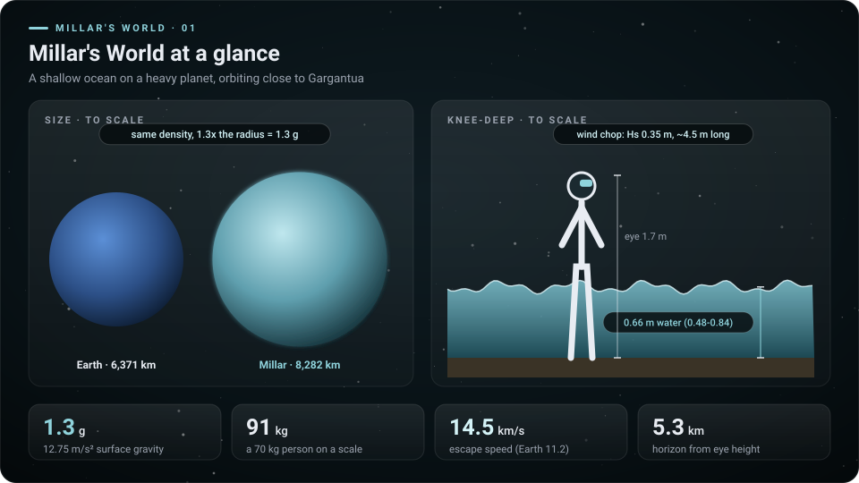
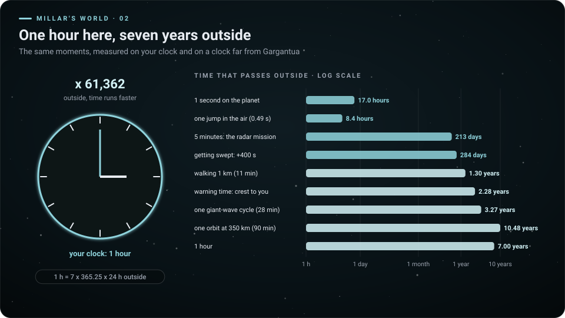
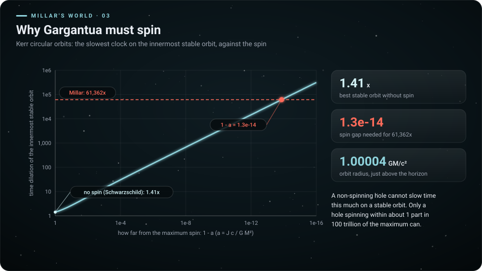
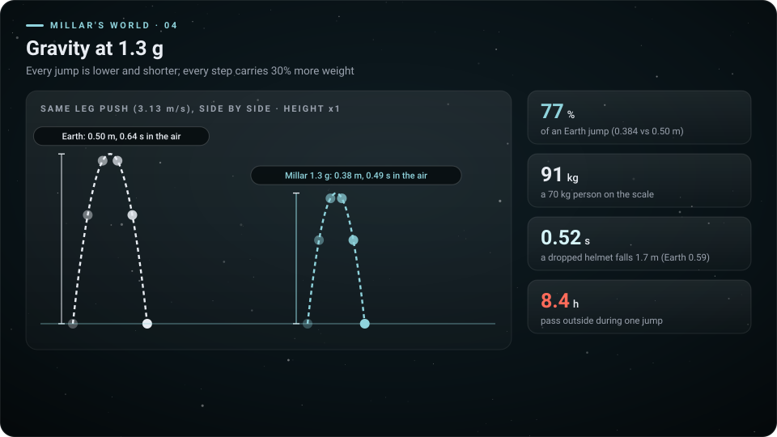
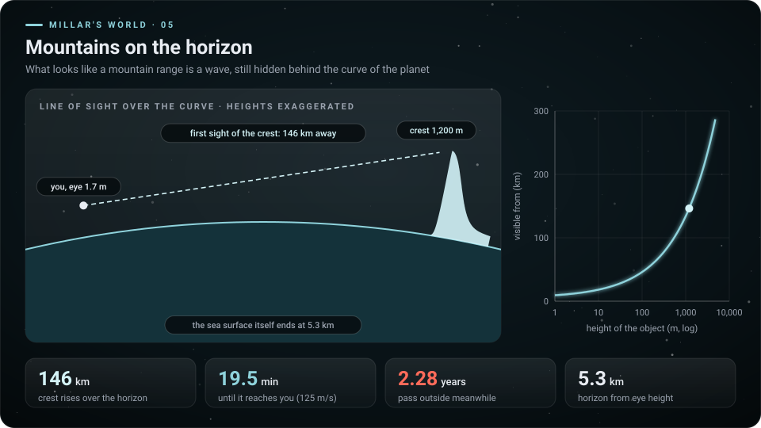
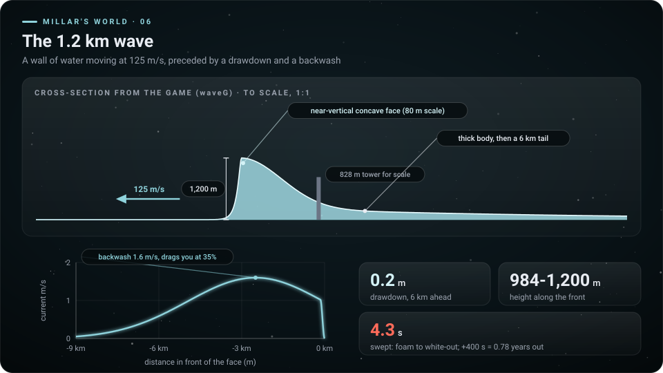
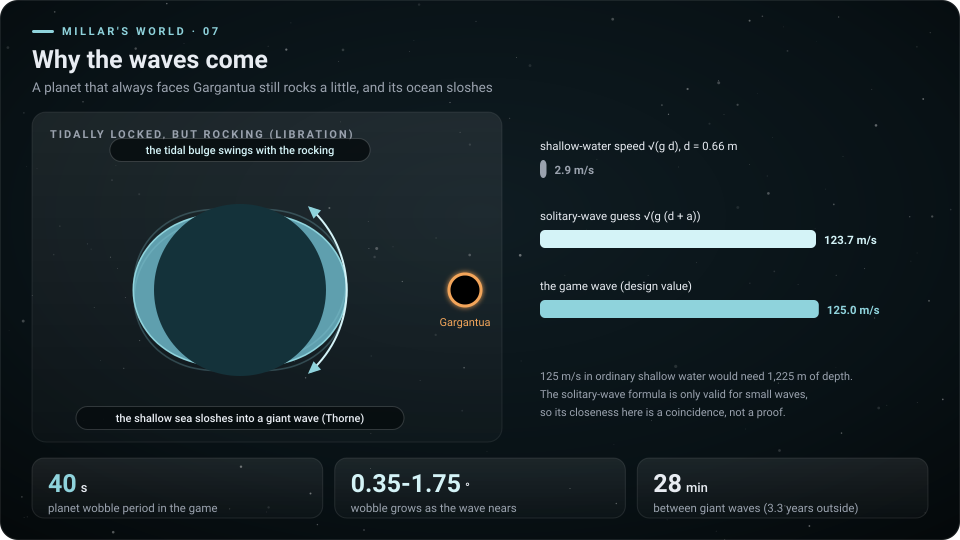
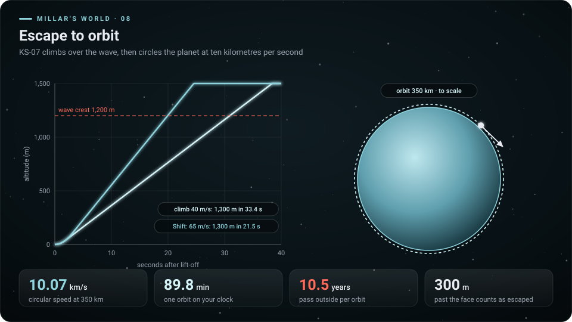

# Konsep halaman detail: Millar's World

Per 9 Oktober 2026 · konsep, belum ada kode halaman yang diubah. Mengikuti pola halaman detail Copper dan Gargantua (`experiences/cooper-station/detail.html`, `experiences/gargantua/detail.html`).

## Ringkasan

- Halaman `experiences/millar/detail.html` berisi 8 bab fisika plus paspor trik. Tiap bab punya diagram dan simulasi kanvas yang beranimasi. Bab "Di balik layar" ditunda, seperti di Copper dan Gargantua.
- Diagram berlabel English (8 diagram sudah dibuat di `gambar/`), teks halaman ID (sumber) + EN. Semua angka diambil dari `CONFIG` game dan dihitung ulang; generator berhenti bila ada yang tidak cocok.
- Temuan baru untuk halaman ini:
  - Dilatasi 61.362x hanya mungkin di dekat lubang hitam yang berputar hampir maksimum: 1 - a = 1,3e-14. Hitungan Kerr ini cocok dengan angka Kip Thorne.
  - Kecepatan 125 m/s adalah parameter desain.
  - Laju orbit di sinematik dulu 7,6 km/s, tidak cocok dengan planet ini (seharusnya 10,07 km/s). Sudah diperbaiki: `ORB.v` di game.

## 1. Arsitektur halaman

| Bagian | Keputusan |
| --- | --- |
| Lokasi | `experiences/millar/detail.html`, satu file tanpa library, jalan dari file:// |
| Kode | Pola detail Gargantua: kamus `S = { key: [id, en] }` + `T()`, `panel()` + satu `loop()`, pemutar umum `player()` (Jalankan / Jeda / Lanjut, slider waktu, label kecepatan), simulasi tetap berjalan walau panelnya tergulir keluar |
| Animasi | Semua kanvas beranimasi walau prefers-reduced-motion; pengaturan itu hanya mematikan efek muncul saat digulir dan gulir halus |
| Warna | Aksen `--mi` #8fd3dc (teal menu), latar biru-hitam, jingga untuk Gargantua, merah untuk waktu di luar |
| Satuan | Detik planet dan "di luar" (tahun 365,25 hari); angka dari `CONFIG`: g 12,75, R 8.282 km, dilatasi 61.362 |
| Navigasi | Kembali `../../index.html?lang=`, Mulai `index.html?lang=` |
| Gambar | `detail/mi-*.svg` untuk galeri (generator sudah menyalin ke `experiences/millar/detail/`) |

### Perubahan di menu utama (`index.html`)

| Tambahan | Isi |
| --- | --- |
| Tombol Pelajari | Anchor `.learn` di bagian Millar: `data-x="millar"` dan `<small data-t="m_learn">`. `render()` sudah generik, jadi tidak perlu diubah |
| Teks `m_learn` | "Satu jam tujuh tahun, gelombang 1,2 km, gravitasi 1,3 g, simulasi interaktif" / "One hour, seven years, the 1.2 km wave, 1.3 g, interactive simulations" |
| `FACTS.m` (bila strip fakta dibuat) | 3 fakta di bawah |

| Fakta | ID | EN | Tautan |
| --- | --- | --- | --- |
| 17 jam | Tiap detik di planet, 17 jam berlalu di luar | Every second on the planet, 17 hours pass outside | `#waktu` |
| 77% | Lompatanmu hanya 77% lompatan di Bumi | Your jump is only 77% of an Earth jump | `#gravitasi` |
| 146 km | Puncak gelombang muncul di cakrawala 146 km jauhnya: 19,5 menit, atau 2,3 tahun di luar | The crest rises over the horizon 146 km away: 19.5 minutes, or 2.3 years outside | `#cakrawala` |

## 2. Struktur halaman

Tiap bab berisi:
- inti satu kalimat (ID + EN);
- simulasi kanvas;
- tabel angka;
- kotak "Coba di game".

| No | Bab (anchor) | Diagram statis | Simulasi (D2) |
| --- | --- | --- | --- |
| Hero | Laut di bawah Gargantua | Tidak ada | Gelombang muncul dari balik cakrawala dan mendekat; dua jam berdetak (planet dan luar) |
| 1 | Planet sekilas `#planet` | `mi-01-planet.svg` | Planet dan Bumi berskala, orang di air setinggi lutut, ombak angin |
| 2 | Satu jam, tujuh tahun `#waktu` | `mi-02-time.svg` | Kalkulator dua jam + preset kegiatan |
| 3 | Kenapa Gargantua harus berputar `#putaran` | `mi-03-spin.svg` | Slider putaran, dilatasi orbit terdalam |
| 4 | Gravitasi 1,3 g `#gravitasi` | `mi-04-gravity.svg` | Lompatan Bumi dan Millar berdampingan, timbangan |
| 5 | Gunung di cakrawala `#cakrawala` | `mi-05-horizon.svg` | Garis pandang di atas lengkung, gelombang muncul |
| 6 | Gelombang 1,2 km `#gelombang` | `mi-06-wave.svg` | Penampang bergerak, air surut, arus balik, tersapu |
| 7 | Kenapa ada gelombang `#goyang` | `mi-07-libration.svg` | Planet bergoyang, air bergolak, perbandingan laju |
| 8 | Lolos ke orbit `#orbit` | `mi-08-escape-orbit.svg` | KS-07 naik melewati gelombang lalu mengorbit |
| 9 | Trik untuk dicoba `#coba` | Tidak ada | Paspor 10 cap (localStorage `millar.passport`) |

### Hero. Laut di bawah Gargantua

| | Teks |
| --- | --- |
| ID | Yang tampak seperti pegunungan di cakrawala adalah gelombang. Setiap detik di sini, 17 jam berlalu di Bumi. |
| EN | What looks like mountains on the horizon is a wave. Every second here, 17 hours pass on Earth. |

Ide kanvas (Medium):
- Pemandangan laut dari mata 1,7 m. Gargantua di langit dengan radius bayangan 9° (`CONFIG.garg`), digambar dengan gradien dan busur piringan.
- Gelombang naik dari balik cakrawala dengan profil `waveG()` dan mendekat pada 125 m/s.
- Dua jam di pojok: jam planet hh:mm:ss dan jam luar (tahun, hari) yang berputar sangat cepat.
- Tombol "Waktu nyata / Dipercepat 20x". Pada waktu nyata, satu siklus gelombang = 28 menit.

### Bab 1. Planet sekilas

| | Teks |
| --- | --- |
| ID | Planet ini 1,3 kali lebih besar dari Bumi dengan kepadatan yang sama, jadi gravitasinya 1,3 g. Seluruh permukaannya laut dangkal setinggi lutut. |
| EN | The planet is 1.3 times the size of Earth with the same density, so gravity is 1.3 g. Its whole surface is a knee-deep sea. |

| Angka | Nilai | Sumber |
| --- | --- | --- |
| Jari-jari | 8.282 km | `CONFIG.R` = 1,3 x 6.371 km (asumsi kepadatan Bumi) |
| Gravitasi | 12,75 m/s² = 1,3 g | `CONFIG.g` |
| Kedalaman | 0,66 m (0,48-0,84) | `CONFIG.sea.bed` + variasi `seabed()` |
| Ombak angin | Hs 0,35 m, panjang sekitar 4,5 m | `CONFIG.chop` |
| Laju lepas | 14,5 km/s (Bumi 11,2) | akar(2 g R) |
| Cakrawala dari mata 1,7 m | 5,3 km | akar(2 R h) |

Coba di game: berjalan dengan WASD; HUD menulis gravitasi dan kedalaman air.

### Bab 2. Satu jam, tujuh tahun

| | Teks |
| --- | --- |
| ID | Di dekat Gargantua waktu berjalan 61.362 kali lebih lambat. Satu jam di planet sama dengan tujuh tahun di Bumi, satu detik sama dengan 17 jam. |
| EN | Near Gargantua time runs 61,362 times slower. One hour on the planet is seven years on Earth; one second is 17 hours. |

| Kegiatan di planet | Lama di planet | Berlalu di luar |
| --- | --- | --- |
| 1 detik | 1 s | 17,0 jam |
| Satu lompatan (di udara) | 0,49 s | 8,4 jam |
| Misi radar Normal | 300 s | 213 hari |
| Tersapu gelombang | +400 s | +284 hari (0,78 tahun) |
| Jalan 1 km | 11 menit | 1,30 tahun |
| Menunggu puncak terlihat sampai tiba | 19,5 menit | 2,28 tahun |
| Satu siklus gelombang raksasa | 28 menit | 3,27 tahun |
| Satu orbit di 350 km | 89,8 menit | 10,5 tahun |
| 1 jam | 1 jam | 7,00 tahun |

Coba di game: HUD menulis "Waktu planet" dan "Waktu di luar"; <kbd>Z</kbd> mempercepat waktu.

### Bab 3. Kenapa Gargantua harus berputar

| | Teks |
| --- | --- |
| ID | Lubang hitam yang diam hanya bisa memperlambat waktu 1,41 kali di orbit stabil terdalamnya. Untuk 61.362 kali, Gargantua harus berputar hampir secepat mungkin: kurang dari maksimum hanya sekitar 1 per 100 triliun. |
| EN | A non-spinning black hole can slow time by only 1.41 times on its innermost stable orbit. To reach 61,362 times, Gargantua must spin almost as fast as possible: short of the maximum by about 1 part in 100 trillion. |

| Angka | Nilai | Derivasi |
| --- | --- | --- |
| Tanpa putaran (Schwarzschild), ISCO 6 GM/c² | 1,41x | 1 / akar(1 - 3GM / (r c²)) |
| Putaran yang memberi 61.362x | 1 - a = 1,33e-14 | Bardeen, Press, Teukolsky: u^t di ISCO Kerr, presisi 60 digit |
| Jari-jari orbit itu | 1,00004 GM/c² (hampir di horizon) | Rumus ISCO Kerr |
| Pembanding | Kip Thorne: kurang dari maksimum 1 per 100 triliun (1e-14) | `docs/millar/konsep-millar.md` |

Simulasi: slider 1 - a dari 1 sampai 1e-16 (log), jarum dilatasi, dan penampang horizon yang mengecil ke ISCO.

Catatan di halaman: experience Gargantua di aplikasi ini memakai lubang hitam tanpa putaran demi kesederhanaan shader. Angka Millar membutuhkan versi yang berputar.

### Bab 4. Gravitasi 1,3 g

| | Teks |
| --- | --- |
| ID | Dorongan kaki yang sama memberi lompatan 77% lompatan di Bumi, dan kamu turun lebih cepat. Timbangan menunjukkan 91 kg untuk orang 70 kg. |
| EN | The same leg push gives a jump 77% as high as on Earth, and you come down sooner. A scale reads 91 kg for a 70 kg person. |

| Angka | Nilai | Derivasi |
| --- | --- | --- |
| Lompatan (laju 3,13 m/s, `CONFIG.jumpV`) | 0,384 m vs 0,50 m di Bumi (76,9%) | v² / 2g |
| Lama di udara | 0,49 s vs 0,64 s | 2v / g |
| Helm jatuh 1,7 m | 0,52 s vs 0,59 s | akar(2h / g) |
| Timbangan | 91 kg untuk 70 kg | x 1,3 |

Coba di game: <kbd>Space</kbd> melompat. Bantuan game menulis "77% lompatan di Bumi".

### Bab 5. Gunung di cakrawala

| | Teks |
| --- | --- |
| ID | Laut yang kamu lihat berakhir 5,3 km jauhnya. Puncak gelombang setinggi 1.200 m sudah muncul di balik lengkung planet dari 146 km. Pada 125 m/s, ia tiba 19,5 menit kemudian. |
| EN | The sea you can see ends 5.3 km away. A 1,200 m crest already rises over the curve of the planet from 146 km. At 125 m/s it arrives 19.5 minutes later. |

| Angka | Nilai | Derivasi |
| --- | --- | --- |
| Cakrawala dari mata 1,7 m | 5,3 km | akar(2 R h) |
| Puncak 1.200 m mulai terlihat | 146 km | akar(2 R H) + akar(2 R h) |
| Waktu peringatan | 19,5 menit = 2,28 tahun di luar | 146 km / 125 m/s |

Simulasi:
- Slider tinggi mata (0,5-50 m) dan tinggi gelombang.
- Garis pandang menyinggung lengkung.
- Gelombang merambat dan muncul tepat saat garis pandang menyentuh puncaknya.

### Bab 6. Gelombang 1,2 km

| | Teks |
| --- | --- |
| ID | Sebelum gelombang tiba, laut surut 20 cm dan arus menarikmu ke arahnya. Mukanya hampir tegak, setinggi 1.200 m, dan bergerak 125 m/s. |
| EN | Before the wave arrives, the sea drops 20 cm and a current pulls you toward it. Its face is nearly vertical, 1,200 m tall, moving at 125 m/s. |

| Angka | Nilai | Sumber |
| --- | --- | --- |
| Tinggi | 984-1.200 m sepanjang muka | `waveHz()` |
| Bentuk | Muka cekung (skala 80 m), puncak bulat 30 m, badan 1.100 m, ekor 6 km | `waveG()` (penampang diagram memakai rumus yang sama) |
| Air surut | 0,2 m, sampai 6 km di depan | `drawdown()` |
| Arus balik | Puncak 1,6 m/s, 2,5 km di depan muka, menyeretmu 35% | `currentAt()`, `CONFIG.current` |
| Tersapu | Buih 0,5 s, di bawah air 3,4 s, putih 4,3 s; +400 s planet | `CONFIG.sweep` |

Simulasi:
- Penampang 1:1 bergerak ke arah pemain, dengan pengukur arus dan kedalaman di kaki.
- Pilihan "lari menjauh / diam": hasilnya waktu sampai tersapu.

Coba di game: <kbd>G</kbd> memanggil gelombang (160 s); HUD menulis arus "ke arah gelombang".

### Bab 7. Kenapa ada gelombang

| | Teks |
| --- | --- |
| ID | Planet selalu menghadapkan sisi yang sama ke Gargantua, tetapi ia sedikit bergoyang. Tonjolan pasang surut ikut berayun, dan laut dangkal bergolak menjadi gelombang raksasa (penjelasan Kip Thorne). |
| EN | The planet always shows Gargantua the same face, but it rocks a little. The tidal bulge swings with it, and the shallow sea sloshes into giant waves (Kip Thorne's explanation). |

| Angka | Nilai | Catatan |
| --- | --- | --- |
| Goyangan di game | Periode 40 s, 0,35° naik ke 1,75° saat gelombang dekat | `CONFIG.wobble`, efek visual |
| Laju air dangkal | 2,9 m/s | akar(g d), d = 0,66 m |
| Laju 125 m/s butuh kedalaman | 1.225 m | v² / g |
| Rumus gelombang soliter | 123,7 m/s | akar(g (d + a)); hanya berlaku untuk gelombang kecil, kedekatannya kebetulan |
| Jarak antar gelombang | 28 menit (3,27 tahun di luar) | 210 km / 125 m/s, dihitung dari `spawn` |

Simulasi: planet bergoyang dengan slider amplitudo, dan air di permukaan berayun lalu menumpuk.

### Bab 8. Lolos ke orbit

| | Teks |
| --- | --- |
| ID | KS-07 harus naik di atas 1.200 m dan berada 300 m di depan muka gelombang. Dengan Shift butuh 21,5 detik. Di orbit 350 km, satu putaran 90 menit, dan di Bumi 10,5 tahun berlalu. |
| EN | KS-07 must climb above 1,200 m and get 300 m clear of the face. With Shift it takes 21.5 seconds. In orbit at 350 km one lap takes 90 minutes, while 10.5 years pass on Earth. |

| Angka | Nilai | Sumber |
| --- | --- | --- |
| Naik | 40 m/s (Shift 65), percepatan 22 m/s² | `CONFIG.fly` |
| Ke 1.300 m | 33,4 s (21,5 s dengan Shift) | Hitungan dari `CONFIG.fly` (komentar game: 22-35 s) |
| Laju orbit 350 km | 10,07 km/s | akar(g R² / r) |
| Satu orbit | 89,8 menit = 10,5 tahun di luar | |

Simulasi: grafik ketinggian vs waktu dengan gelombang yang datang, lalu animasi orbit berskala dengan jam luar.

Coba di game: <kbd>E</kbd> naik ke KS-07, <kbd>R</kbd>/<kbd>F</kbd> naik-turun, <kbd>Shift</kbd>, <kbd>V</kbd> kokpit.

### Bab 9. Trik untuk dicoba (paspor)

| Cap | Cara | Yang terjadi |
| --- | --- | --- |
| Lompat di 1,3 g | <kbd>Space</kbd> | 77% lompatan di Bumi |
| Jam yang berlari | Lihat HUD "Waktu di luar" sambil berdiri 1 menit | 42,6 hari berlalu |
| Gunung yang bergerak | Tunggu sampai puncak muncul di cakrawala | Gelombang tiba sekitar 19,5 menit kemudian |
| Air surut | Perhatikan kedalaman di HUD saat gelombang dekat | Turun sekitar 20 cm, arus menarik |
| Tersapu | Diam saat gelombang tiba | +400 s planet, 0,78 tahun di luar |
| Radar | Misi, <kbd>M</kbd> radar | Galat 5% + 2 m, jangkauan 250 m |
| Blackbox | Ambil ketiga pecahan (tahan <kbd>E</kbd>) | Ping suara blackbox |
| Lolos | Terbangkan KS-07 melewati gelombang | Lolos bila 300 m di depan muka |
| Orbit | Sinematik keberangkatan | Hasil di atas orbit 350 km |
| Visor basah | Lari di air | Tetes air di visor, embun napas |

## 2b. Animasi per bab

Keputusan sama dengan Copper dan Gargantua: semua kanvas bergerak saat dijalankan, tidak langsung ke hasil akhir. Kanvas tetap beranimasi walau "Animation effects" Windows mati. Kontrol pemutar: Jalankan / Jeda / Lanjut, slider waktu, label kecepatan putar.

| Bab | Animasi | Kontrol |
| --- | --- | --- |
| Hero | Ombak angin bergulir, gelombang naik dari balik cakrawala dan mendekat, piringan Gargantua berkilau, dua jam berdetak | Waktu nyata / Dipercepat |
| 1 Planet | Ombak angin di sekitar kaki astronaut, planet berputar pelan | Tidak ada |
| 2 Waktu | Jarum jam planet berputar normal, kalender luar berganti cepat; preset menjalankan kegiatan (lompat, misi, satu orbit) sambil kedua jam berjalan | Slider lama, preset, Jalankan |
| 3 Putaran | Jarum dilatasi naik saat slider putaran digeser; orbit terdalam menyusut ke horizon | Slider 1 - a, Jalankan sapuan otomatis |
| 4 Gravitasi | Dua astronaut melompat berulang (Bumi dan Millar), jejak busur | Massa, Jalankan |
| 5 Cakrawala | Gelombang mendekat dari 200 km, muncul di atas lengkung; garis pandang ikut | Slider tinggi mata dan gelombang, slider waktu |
| 6 Gelombang | Penampang 1:1 bergerak 125 m/s, air surut, arus menyeret, tersapu putih | Jalankan / Jeda, lari / diam, slider waktu |
| 7 Goyangan | Planet bergoyang, air berayun, tumpukan air menjadi gelombang | Slider amplitudo |
| 8 Orbit | KS-07 naik dengan Shift atau tanpa, gelombang lewat di bawah, lalu mengorbit planet berskala; jam luar berputar | Jalankan, Shift |

## 3. Daftar diagram

Dibangkitkan oleh `tools/diagram_detail_millar.py` (Python, tanpa library luar).
- Gaya sama dengan diagram Gargantua: 960 x 540, latar bintang, glow, kartu angka, aksen teal.
- Penampang gelombang memakai `waveG()`, `drawdown()`, dan `currentAt()` yang sama dengan game.
- Dilatasi Kerr dihitung dengan presisi 60 digit.
- Generator meng-assert angka kunci:

  | Kelompok | Angka |
  | --- | --- |
  | Waktu | 17,04 jam |
  | Gravitasi | 76,9% |
  | Cakrawala | 5,3 km, 146 km, 19,5 menit, 2,28 tahun |
  | Laju gelombang | 2,90 dan 123,7 m/s |
  | Orbit | 10,07 km/s, 89,8 menit, 10,48 tahun |
  | Putaran | 1,41x, 1 - a antara 1e-14 dan 2e-14 |
  | Naik KS-07 | 21,5 dan 33,4 s |

| File | Bab | Menunjukkan |
| --- | --- | --- |
| `mi-01-planet.svg` | 1 | Bumi dan Millar berskala, orang di air setinggi lutut |
| `mi-02-time.svg` | 2 | Jam satu jam, batang log waktu di luar untuk 9 kegiatan |
| `mi-03-spin.svg` | 3 | Dilatasi ISCO Kerr vs 1 - a, garis 61.362x |
| `mi-04-gravity.svg` | 4 | Busur lompatan Bumi vs Millar |
| `mi-05-horizon.svg` | 5 | Garis pandang di atas lengkung, jarak terlihat vs tinggi |
| `mi-06-wave.svg` | 6 | Penampang 1:1 dengan menara 828 m untuk skala, kurva arus balik |
| `mi-07-libration.svg` | 7 | Planet bergoyang, perbandingan laju |
| `mi-08-escape-orbit.svg` | 8 | Ketinggian vs waktu, orbit 350 km berskala |

## 4. Tahap implementasi

| Tahap | Isi | File | Effort | Model | Thinking |
| --- | --- | --- | --- | --- | --- |
| M-D1 | `detail.html`: kerangka dari detail Gargantua (`player()`, `panel()`, kamus), diagram statis, galeri, paspor | `experiences/millar/detail.html` | Medium | Sonnet 5.5 | medium |
| M-D2a | Simulasi: planet, waktu, gravitasi, cakrawala, goyangan | `detail.html` | Medium | Sonnet 5.5 | medium |
| M-D2b | Hero laut dan gelombang, penampang gelombang bergerak (kembaran `waveG` / `currentAt`), dilatasi Kerr (ditulis dalam e = 1 - a, cukup presisi double), orbit | `detail.html` | High | Opus 5.5 | high |
| M-D3 | Tombol Pelajari + `m_learn` (+ `FACTS.m` bila strip dibuat) | `index.html` | Low | Haiku 4.5 | low |
| M-D4 | Uji `tools/uji_detail_millar.cjs` (angka, animasi walau reduce-motion, tanpa error, tanpa gulir mendatar, tanpa tombol bergaris bawah, ganti bahasa, tautan menu) | `tools/` | Low | Sonnet 5.5 | low |

## Status

| Tahap | Status | Catatan |
| --- | --- | --- |
| M-D1 | Selesai | `experiences/millar/detail.html`, teks ID + EN, galeri 8 diagram (`experiences/millar/detail/`), paspor 10 cap (localStorage `millar.passport`) |
| M-D2a | Selesai | Planet, dua jam, gravitasi, cakrawala, goyangan |
| M-D2b | Selesai | Hero laut dan gelombang, penampang 1:1 (`waveG` / `drawdown` / `currentAt` kembaran game), dilatasi Kerr, orbit 10,07 km/s |
| M-D3 | Sebagian | Tombol Pelajari di bagian Millar menu (`m_learn`); strip `FACTS` belum (sama dengan Copper dan Gargantua) |
| M-D4 | Selesai | `tools/uji_detail_millar.cjs` (35 cek lulus, reduce-motion diemulasikan) |

Temuan saat membangun:
- Dilatasi Kerr tidak butuh BigInt: rumus Bardeen ditulis ulang dalam e = 1 - a (akar pangkat tiga dari e (2 - e), bukan dari 1 - a²), jadi presisi double cukup. Hasil JS cocok dengan Python 60 digit: 1e-14 -> 67.526,43x, 1,333e-14 -> 61.356,9x.
- Bab cakrawala memakai satu skala tegak untuk lengkung, tinggi mata, dan gelombang (dibesarkan sekitar 19x di desktop), jadi garis pandang menyinggung permukaan tepat di 5,3 km dan puncak menyentuh garis itu di 146 km.

## Catatan dan batasan

- **125 m/s** adalah parameter desain (`CONFIG.wave.v`). Laju gelombang air dangkal setinggi lutut hanya 2,9 m/s. Rumus gelombang soliter memberi 123,7 m/s, tetapi rumus itu tidak berlaku untuk gelombang setinggi ini; kedekatannya kebetulan dan halaman menulisnya begitu.
- **Asumsi**: jari-jari planet (kepadatan sama dengan Bumi) dan kedalaman laut tidak berasal dari sumber; keduanya pilihan desain (`docs/millar/konsep-millar.md`).
- **Sinematik orbit**: kapal dulu digerakkan 7,6 km/s (laju orbit Bumi). Untuk planet ini, laju orbit lingkaran di 350 km adalah 10,07 km/s. Sudah diperbaiki: `ORB.v` = akar(g R² / (R + 350 km)) dihitung dari `CONFIG.g` dan dipakai di `cineStep()`. Tanah di bawah kapal kini bergeser 32% lebih cepat.
- **Dilatasi**:
  - Angka 61.362x berlaku untuk planet di orbit. Halaman memakai faktor yang sama untuk orbit KS-07 di 350 km (perbedaan ketinggian terhadap Gargantua bisa diabaikan).
  - Dilatasi Kerr di ISCO adalah u^t untuk pengamat jauh (Bardeen, Press, Teukolsky 1972). Thorne menempatkan Millar dekat orbit itu; angka 1,33e-14 adalah hitungan halaman ini, dan Thorne menulis sekitar 1e-14.
- **Gargantua di langit Millar** digambar dari pengamat 16,08 rs agar radius bayangannya 9° (`CONFIG.garg`). Itu pilihan visual, bukan posisi orbit fisik planet yang sebenarnya (yang hampir di horizon).
- **Gargantua tanpa putaran**: experience Gargantua di aplikasi ini memakai lubang hitam tanpa putaran (Schwarzschild). Bab 3 menjelaskan kenapa Millar membutuhkan versi yang berputar.
- **Jarak antar gelombang** 28 menit dihitung dari `spawn` 150 km + 60 km; game tidak menuliskannya.
- Tidak memakai judul, logo, musik, cuplikan, atau desain kendaraan film; semua diagram orisinal. Kip Thorne disebut sebagai sumber ilmiah.
