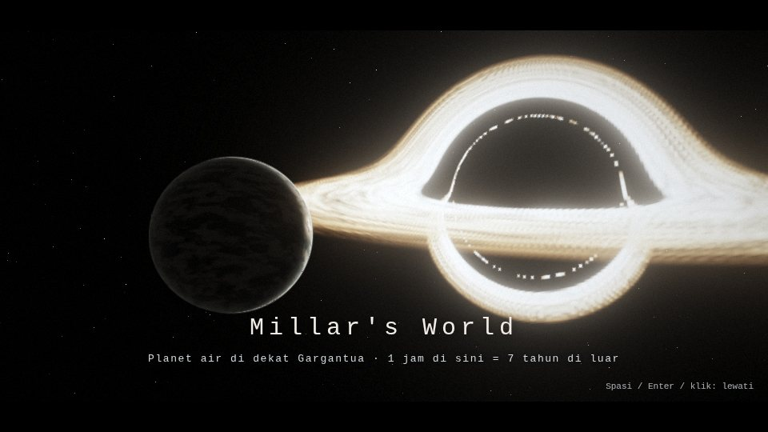
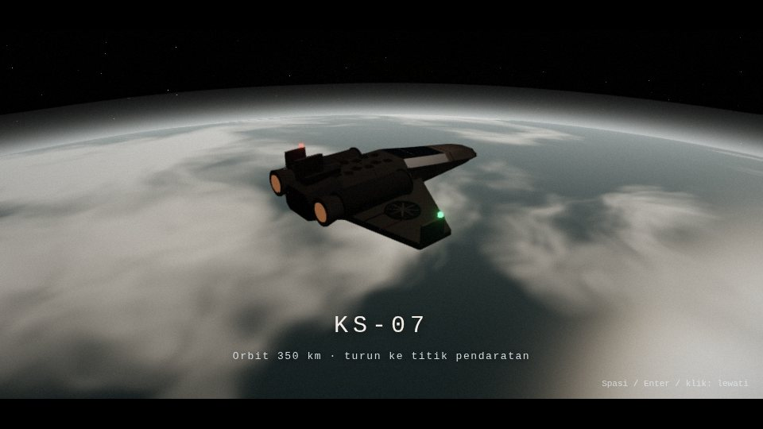
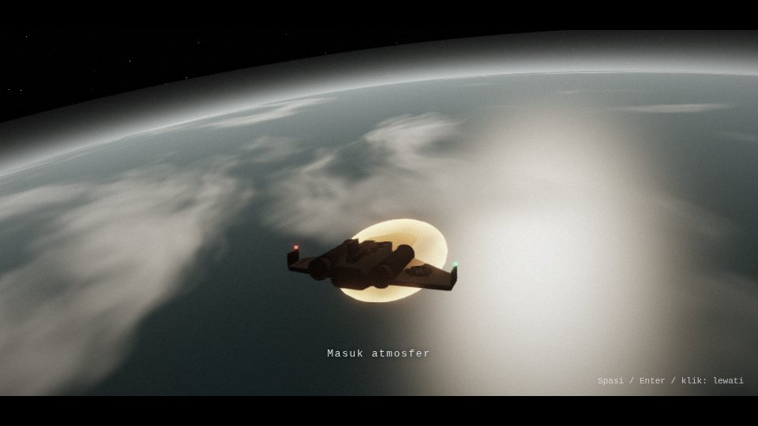
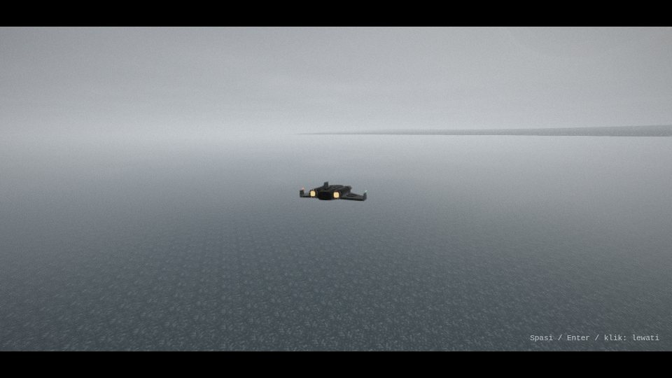
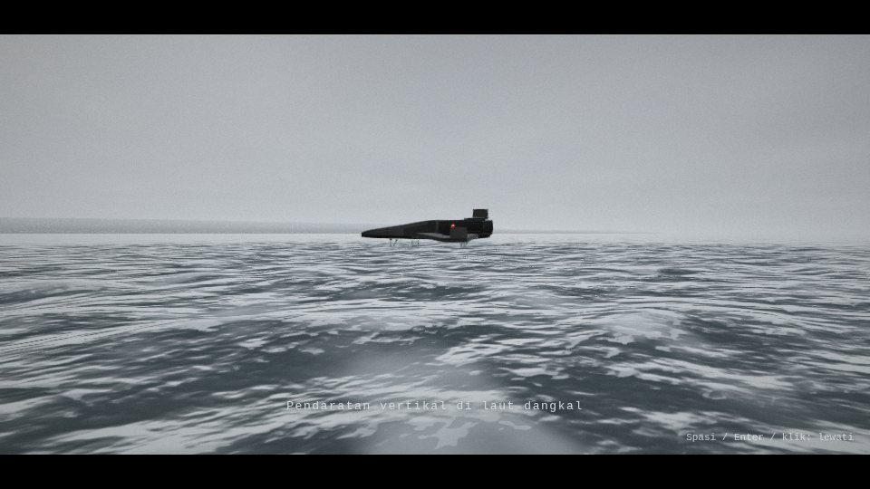
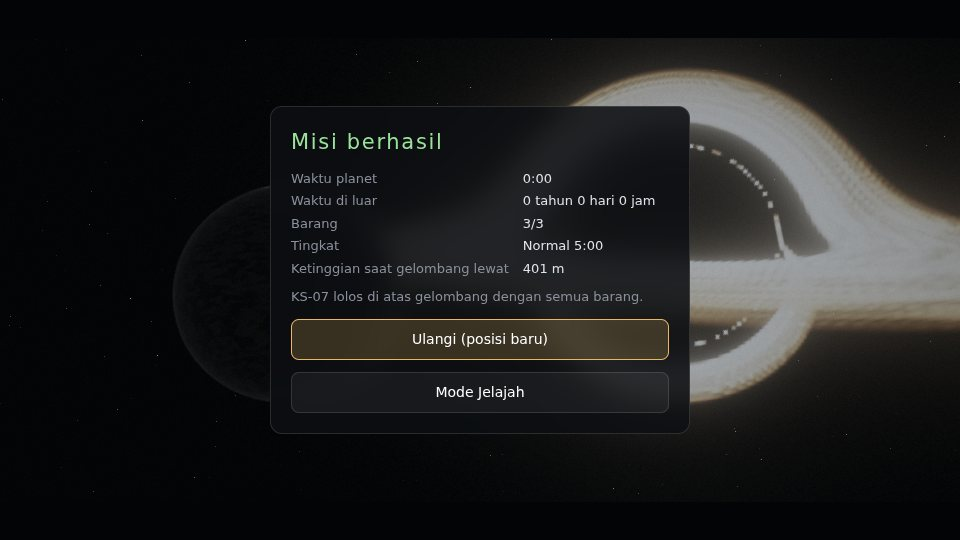

# Rencana M4 Millar's World: Pandangan Orbit dan Sinematik

Per 30 September 2026 · Status: selesai (lihat bagian "Status")

## Ringkasan

- Adegan orbit sendiri: planet air 8.282 km di dekat Gargantua, latar dari cubemap lensa Gargantua yang sudah ada (GCUBE), bintang, awan tebal, pinggir atmosfer, dan KS-07 v5 di orbit 350 km.
- Sinematik kedatangan 35 s sebelum misi (sekali per sesi, bisa dimatikan di layar mulai, bisa dilewati): jauh, orbit, masuk atmosfer, turun vertikal, mendarat di titik semula, lalu kendali diserahkan.
- Sinematik keberangkatan setelah misi berhasil: naik menembus awan, keluar atmosfer, lalu hasil misi tampil di atas pandangan jauh planet dan Gargantua.
- Pandangan orbit bisa dibuka dari panel kontrol (`) di mode Jelajah atau sebelum mulai.
- Menu utama: deskripsi kartu Millar diperbarui (turun dari orbit, radar, KS-07, gelombang).

## Urutan sinematik kedatangan

| Waktu | Adegan | Isi |
| --- | --- | --- |
| 0-7 s | Jauh | Planet sabit di depan piringan Gargantua, kamera mendekat dari 62.000 ke 44.000 km. Judul "Millar's World" dan "1 jam di sini = 7 tahun di luar" |
| 7-14 s | Orbit | KS-07 di 350 km di atas awan, kamera memutar di belakang-atas |
| 14-21 s | Masuk atmosfer | Hidung turun, ketinggian 350 ke 70 km, plasma jingga, guncangan, gemuruh, memutih |
| 21-35 s | Turun di dunia | Dilihat dari kursi pilot (orang pertama, layar MFD hidup): muncul dari putih 450 m di atas laut, 900 m di belakang titik pendaratan, melambat, melayang, turun vertikal dengan kipas menyala, semburan air, kaki turun di bawah 6 m, guncangan kecil saat menyentuh air |
| 35-36 s | Mulai | Kilas putih, pemain turun di samping tangga menghadap serong ke laut, misi dan hitung mundur mulai (lokasi pecahan dihitung dari posisi ini) |

Spasi, Enter, Esc, atau klik = lewati langsung ke permainan.

| Jauh | Orbit | Masuk atmosfer |
| --- | --- | --- |
|  |  |  |

| Turun | Mendarat | Hasil di orbit |
| --- | --- | --- |
|  |  |  |

Gambar dari sandbox (SwiftShader, 960 x 540, preset Tinggi); warna dan kehalusan di GPU asli bisa berbeda.

## Urutan sinematik keberangkatan (misi berhasil)

| Waktu | Adegan | Isi |
| --- | --- | --- |
| 0-5 s | Dunia | Wahana naik tegak dari posisi saat lolos, kamera di bawah-belakang, memutih |
| 5-14 s | Keluar atmosfer | Ketinggian 60 ke 320 km, plasma memudar, nosel menyala. "Kembali ke orbit" |
| 14 s ke atas | Jauh | Planet dan Gargantua, layar hasil misi tampil di atasnya. Ulangi = misi baru tanpa sinematik kedatangan |

Gagal (tersapu atau tertelan) tetap langsung ke layar hasil seperti M3.

## Adegan orbit

| Bagian | Isi |
| --- | --- |
| Satuan | km, planet di titik asal (adegan terpisah dari dunia yang dalam meter; kedalaman logaritmik) |
| Latar | `GCUBE` (rgb = cahaya piringan, a = latar terlihat) + bintang prosedural di bagian latar yang terlihat. Arah Gargantua sama dengan di permukaan (`GDIR`) |
| Planet | Radius 8.282 km (1,3 x Bumi, massa jenis sama, lihat konsep). Laut gelap, awan tebal memanjang searah putaran dengan celah, kilau piringan di laut terbuka, terminator lembut, pinggir atmosfer kebiruan |
| Cahaya | Dari piringan akresi (arah `GDIR`, hangat) |
| Atmosfer | Selubung 140 km, kepadatan turun eksponensial (skala 38 km), terang di sisi siang dan saat menghadap cahaya; saat kamera di dalamnya menjadi langit |
| KS-07 | Model v5 yang sama (warna diubah ke linear untuk Lambert), lampu navigasi, nosel, plasma masuk atmosfer |

## Preset kualitas

| Preset | Oktaf awan planet | Lensa Gargantua (sudah ada) |
| --- | --- | --- |
| Ultra | 5 | 512, 320 langkah, hidup |
| Tinggi | 5 | 384, 240 langkah, hidup |
| Sedang | 4 | 384, 200 langkah |
| Rendah | 3 | sesuai preset |
| Hemat | 3 | sesuai preset |

Saat adegan orbit tampil, laut, riak, dan langit dunia tidak dirender (hanya cubemap Gargantua dan adegan orbit).

## Yang tidak dikerjakan

| Item | Alasan |
| --- | --- |
| Cahaya planet dibelokkan lensa Gargantua | Planet berada di depan Gargantua (dekat pengamat), jadi pembelokan cahaya planet sendiri kecil; bisa ditambah bila diminta |
| Gelombang raksasa terlihat dari orbit | Tertutup awan tebal di skala planet; bisa ditambah sebagai garis buih panjang bila diminta |

## Status

Selesai 30 September 2026.

Uji: `tools/uji_millar.py` kini 68 pemeriksaan, semua lulus, tanpa error halaman. Pemeriksaan M4 dan kokpit:

| Uji | Hasil |
| --- | --- |
| Adegan orbit 3 s, 10 s, 17 s | Tanpa nilai tidak valid, terang rata-rata HDR 0,262 / 0,173 / 0,225 |
| Kedatangan penuh (langkah tetap 1/30 s) | Mendarat 0,00 m dari titik semula, celah terendah ke titik mendarat 0,01 m (tidak menembus), kamera tidak pernah di bawah air, misi mulai, pemain di titik awal |
| Lewati (Spasi) | Sinematik berhenti, permainan dan misi mulai |
| Keberangkatan | Hasil tidak tampil di awal, tampil pada 14,1 s di atas adegan orbit tanpa nilai tidak valid; Ulangi = misi baru, tanpa sinematik, wahana kembali mendarat |
| Pandangan orbit dari panel | Ditolak saat misi berjalan, tampil di Jelajah, tombol apa saja kembali |
| Kokpit v5 | Kaca terpisah (36 titik) menghadap keluar 12/12, pelapis menghadap ke dalam 52/52, urutan segitiga badan 2.436/2.436, mata 0,27 m di bawah atap, pandangan lewat hidung 5,5 derajat; di pandangan kokpit layar tengah tergambar, tanpa nilai tidak valid |

Catatan: pemanggilan kunci kursor kini lewat `lockPointer()` (menangkap penolakan promise "Pointer is already locked" yang sempat muncul di uji).
## Perbaikan setelah uji pemilik (M4b)

Per 30 September 2026.

| No | Permintaan | Perbaikan |
| --- | --- | --- |
| 1 | Percikan di kaki kurang terlihat | Tiap langkah kini sekitar 280 butir (dua kaki, preset Tinggi), tetes 1,9 kali lebih besar, naik sampai 0,57 m, terlempar ke depan searah langkah. Ditambah semburan terus-menerus di depan tulang kering saat bergerak di air (makin banyak saat lari dan air makin dalam). Tetes lebih terang dan lebih pekat dari buih agar tidak tenggelam di permukaan putih |
| 2 | Bayangan dari cahaya Gargantua | Peta bayangan searah cahaya piringan (22 derajat di atas cakrawala), 96 x 96 m di sekitar kamera, 2.048 px (Ultra, Tinggi), 1.024 (Sedang, Rendah), 512 (Hemat). Penghalang: KS-07, pecahan misi, dan tubuh pemain (kepala, badan, lengan, kaki berayun ikut langkah; hanya untuk bayangan). Penerima: dasar laut dekat (cahaya dasar, kaustik, hamburan, buih) dan wahana/pecahan (cahaya langsung hangat + bayangan sendiri). Mendung: tipis dan lembut; cerah: tegas. Tepi halus dengan 8 sampel cakram berputar acak |
| 3 | Gosong harus bergradasi, bukan hitam total | Model panas masuk atmosfer: terpanas di hidung dan perut depan (putih pudar), lalu abu-abu, lalu jelaga hitam di hilir dan tepi, baru warna cat; bergaris searah aliran. Badan diberi cincin tambahan tiap 0,6 m (bentuk tetap) supaya gradasi halus. Berlaku juga di Copper |
| 4 | A = miring ke kanan tapi belok ke kiri | Tanda guling dibalik: A kini belok kiri dengan sayap kiri turun (dan sebaliknya). Laju belok naik-turun halus (tidak langsung penuh), miring juga sedikit saat melayang. Cakrawala buatan di layar MFD ikut dibalik |
| 5 | Pendaratan sebaiknya orang pertama | Adegan 21-35 s kini dari kursi pilot, lalu pemain mulai di samping tangga |

Uji: `tools/uji_millar.py` kini 72 pemeriksaan, semua lulus. Baru:

| Uji | Hasil |
| --- | --- |
| Percikan kaki | 282 butir per langkah, tinggi 0,57 m, terlempar sampai 4,11 m ke depan (pemain berlari 3 m/s) |
| Belok kiri (A) | Arah +64 derajat dalam 1,5 s, miring 23,2 derajat, ujung sayap kiri 3,89 m lebih rendah dari kanan |
| Bayangan | Terang di bayangan KS-07 15% lebih gelap dibanding bayangan dimatikan (cerah, kuat 0,70), peta 2.048 px |
| Gosong | Rata-rata warna perut: hidung 0,487 (putih pudar), tengah 0,264 (abu-abu), hilir 0,054 (jelaga) |
| Kedatangan | Kokpit tampil 447 langkah, mendarat 0,00 m dari titik semula, kamera tidak pernah di bawah air, pemain 1,0 m dari tangga |

Catatan: bayangan paling jelas saat menunduk atau di air jernih; di sudut landai, pantulan langit di permukaan lebih kuat daripada dasar laut (seperti di laut sungguhan). Percikan kaki paling terlihat saat berlari sambil sedikit menunduk.
